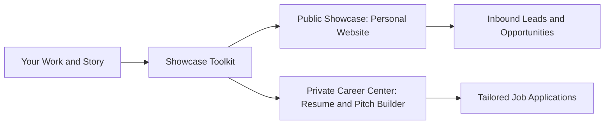

# Showcase: Personal Portfolio & Career Command Center

**Showcase** is an open, easy-to-use toolkit for personal portfolios and private career intelligence. It gives you and your friends a simple way to launch a high-craft personal website and run a private AI career command center.

---

## The Dual-Engine System

Showcase operates with two complementary engines:

1. **Engine 1: Public Showcase**: A clean, fast, accessible personal website that presents your work, case studies, and contact options.
2. **Engine 2: Private Career Center**: A private AI workspace (`.agents/career/`) that tailors resumes, writes pitch messages, and organizes your career stories.



---

## Key Features

- **2-Minute Guided Setup**: Answer 3 quick questions in plain English to set up your personal website and career center.
- **4 Visual Style Presets**: Choose between *Warm Editorial*, *Clean Minimal*, *Bold Creative*, or *Dark Studio*.
- **Non-Destructive Integration (Path A)**: Connect Showcase to your existing personal website without modifying or moving your source files.
- **Zero-Config Greenfield Starter (Path B)**: Launch a standalone, zero-dependency HTML5 portfolio that opens instantly in any browser.
- **One-Click Tailored Resumes**: Generate single-page vector PDFs, ATS plain-text copy buffers, and 80-word founder introduction notes.
- **Zero Technical Jargon**: Built for designers, copywriters, career switchers, and developers. No complex command-line syntax required.

---

## Installation & Setup

Choose the setup method that works best for you:

### Method 1: Use with AI Assistant (Recommended)

1. Copy or clone the `showcase` skill into your project or `.agents/skills/` directory:
   ```bash
   git clone https://github.com/jedm-dev/showcase.git .agents/skills/showcase
   ```
2. Open your AI chat and type:
   ```text
   /showcase init
   ```
3. Answer the 3 quick questions. Showcase will configure your website and career center in under 2 minutes.

### Method 2: Command Line (Node.js)

Run the setup script directly in your terminal:

```bash
node skills/showcase/scripts/init_workspace.js
```

- `--dir <path>`: Specify target project folder (defaults to current folder).
- `--theme <preset>`: Choose `warm-editorial`, `clean-minimal`, `bold-creative`, or `dark-studio`.
- `--mode <type>`: Choose `existing-portfolio` or `greenfield-starter`.

### Method 3: Instant HTML5 (No Code / Zero Build)

1. Copy the [`starter-portfolio/`](file:///c:/Users/ASUS/Documents/VSCode/jedmamosto-portfolio/showcase/skills/showcase/templates/starter-portfolio/index.html) folder to your computer.
2. Double-click `index.html` to open it in your browser immediately.
3. Drag the folder to [Vercel](https://vercel.com) or [Netlify](https://netlify.com) for free web hosting.

---

## Command Quick Reference

| Command | Category | Purpose | Description |
| :--- | :--- | :--- | :--- |
| `/showcase init` | Setup | Start here | Sets up your website and career center in 3 simple steps. |
| `/showcase resume [job]` | Career | Apply to a job | Creates a tailored 1-page resume for a target role. |
| `/showcase pitch [name]` | Career | Contact a lead | Writes a friendly, 80-word introduction email or message. |
| `/showcase publish [work]` | Portfolio | Add a project | Turns notes or links into a clean case study. |
| `/showcase hunt [role]` | Career | Find opportunities | Matches your profile against open roles. |
| `/showcase polish [page]` | Design | Improve appearance | Audits spacing, typography, and contrast. |
| `/showcase profile` | Career | Update your story | Opens your master career notes to add new wins. |
| `/showcase preview` | Portfolio | View live work | Opens your portfolio in your local browser. |

---

---

## Toolkit Assets & Resources

Explore the core scripts, templates, schemas, and starter website:

- **AI Skill Assistant**: [Showcase Skill Definition](file:///c:/Users/ASUS/Documents/VSCode/jedmamosto-portfolio/showcase/skills/showcase/SKILL.md)
- **Greenfield Starter Website**: [Starter Portfolio Template](file:///c:/Users/ASUS/Documents/VSCode/jedmamosto-portfolio/showcase/skills/showcase/templates/starter-portfolio/index.html)
- **Core Automation Scripts**:
  - [Workspace Detector](file:///c:/Users/ASUS/Documents/VSCode/jedmamosto-portfolio/showcase/skills/showcase/scripts/detect_workspace.js)
  - [Workspace Initializer](file:///c:/Users/ASUS/Documents/VSCode/jedmamosto-portfolio/showcase/skills/showcase/scripts/init_workspace.js)
  - [Resume Compiler](file:///c:/Users/ASUS/Documents/VSCode/jedmamosto-portfolio/showcase/skills/showcase/scripts/compile_resume.js)
  - [Case Study Publisher](file:///c:/Users/ASUS/Documents/VSCode/jedmamosto-portfolio/showcase/skills/showcase/scripts/publish_case_study.js)
- **Data Schemas & ATS Guide**:
  - [Config Schema](file:///c:/Users/ASUS/Documents/VSCode/jedmamosto-portfolio/showcase/skills/showcase/references/config-schema.json)
  - [Career Profile Schema](file:///c:/Users/ASUS/Documents/VSCode/jedmamosto-portfolio/showcase/skills/showcase/references/profile-schema.json)
  - [Project Schema](file:///c:/Users/ASUS/Documents/VSCode/jedmamosto-portfolio/showcase/skills/showcase/references/project-schema.json)
  - [ATS Parsing Rules](file:///c:/Users/ASUS/Documents/VSCode/jedmamosto-portfolio/showcase/skills/showcase/references/ats-rules.md)
- **Document Templates**:
  - [Profile Template](file:///c:/Users/ASUS/Documents/VSCode/jedmamosto-portfolio/showcase/skills/showcase/templates/profile_template.md)
  - [Vector PDF Resume Template](file:///c:/Users/ASUS/Documents/VSCode/jedmamosto-portfolio/showcase/skills/showcase/templates/resume_template.html)
  - [80-Word Pitch Template](file:///c:/Users/ASUS/Documents/VSCode/jedmamosto-portfolio/showcase/skills/showcase/templates/pitch_template.md)

---

## Documentation & Guides

Explore user guides and developer references in [`docs/`](file:///c:/Users/ASUS/Documents/VSCode/jedmamosto-portfolio/showcase/docs/index.md):

### User Guides (Everyday English)
- **[2-Minute Quickstart Guide](file:///c:/Users/ASUS/Documents/VSCode/jedmamosto-portfolio/showcase/docs/guides/quickstart.md)**: Setup your website and career center in 3 simple steps.
- **[Visual Themes & Customization](file:///c:/Users/ASUS/Documents/VSCode/jedmamosto-portfolio/showcase/docs/guides/visual-themes.md)**: 4 visual styles (*Warm Editorial*, *Clean Minimal*, *Bold Creative*, *Dark Studio*).
- **[Private Career Center & Resumes](file:///c:/Users/ASUS/Documents/VSCode/jedmamosto-portfolio/showcase/docs/guides/career-hub.md)**: Generate single-page PDF resumes, ATS text, and 80-word pitch notes.
- **[Publishing Case Studies](file:///c:/Users/ASUS/Documents/VSCode/jedmamosto-portfolio/showcase/docs/guides/case-studies.md)**: Turn project wins into structured proof on your portfolio.

### Developer & Architecture Reference
- **[Documentation Hub Index](file:///c:/Users/ASUS/Documents/VSCode/jedmamosto-portfolio/showcase/docs/index.md)**: Master catalog of all guides and technical specs.
- **[System Architecture](file:///c:/Users/ASUS/Documents/VSCode/jedmamosto-portfolio/showcase/docs/reference/architecture.md)**: Dual-engine system topology and data flows.
- **[Data Contracts & Schemas](file:///c:/Users/ASUS/Documents/VSCode/jedmamosto-portfolio/showcase/docs/reference/data-contracts.md)**: Strict schemas for config, profile, and projects.
- **[Framework Adapters](file:///c:/Users/ASUS/Documents/VSCode/jedmamosto-portfolio/showcase/docs/reference/framework-adapters.md)**: How adapters sync data to Next.js, Astro, or static HTML.
- **[CLI Commands & Error Recovery](file:///c:/Users/ASUS/Documents/VSCode/jedmamosto-portfolio/showcase/docs/reference/cli-commands.md)**: Command router, finite state machine, and error handling.
- **[ADR-0001: Architecture Decision](file:///c:/Users/ASUS/Documents/VSCode/jedmamosto-portfolio/showcase/docs/adr/0001-showcase-toolkit-architecture.md)**: Dual-engine architecture decision record.
- **[Release Changelog](file:///c:/Users/ASUS/Documents/VSCode/jedmamosto-portfolio/showcase/CHANGELOG.md)**: Version history adhering to SemVer 2.0.0 and Keep a Changelog 1.1.0.

