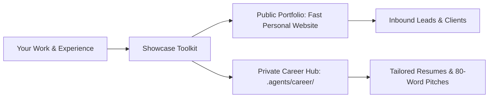

# Showcase: Personal Portfolio & Career Command Center

[](https://opensource.org/licenses/MIT)
[](file:///c:/Users/ASUS/Documents/VSCode/jedmamosto-portfolio/showcase/skills/showcase/tests/core.test.js)
[](file:///c:/Users/ASUS/Documents/VSCode/jedmamosto-portfolio/showcase/docs/guides/visual-themes.md)
[](file:///c:/Users/ASUS/Documents/VSCode/jedmamosto-portfolio/showcase/CHANGELOG.md)

**Showcase** is an open-source toolkit for personal portfolios and private career intelligence. It gives you a fast, accessible personal website and a private AI career center on your computer.

---

## 1. The Dual-Engine System

Showcase solves two problems in one simple workflow:

1. **Engine 1: Public Showcase**: A clean, accessible personal website that presents your work, case studies, and contact details.
2. **Engine 2: Private Career Center**: A private folder (`.agents/career/`) where AI helps you tailor resumes, write pitch emails, and organize your work history.



---

## 2. Why Choose Showcase?

| Traditional Site Builders | Raw Resumes & Notion Docs | Showcase Toolkit |
| :--- | :--- | :--- |
| Expensive monthly subscriptions ($15–$40/mo). | Scattered notes and untyped documents. | **100% Free & Open-Source** (MIT License). |
| Vendor lock-in; hard to export data. | Manual copy-pasting for every job post. | **100% Data Ownership** (Plain Markdown & JSON). |
| Complex code setup or bloated templates. | No public portfolio or web presence. | **Zero-Build Starter** (Runs in any browser). |
| No AI resume tailoring assistance. | Resumes fail automated ATS scans. | **Built-in AI Application Kit** (PDF, ATS & Pitches). |

---

## 3. The 4 Visual Style Presets

Showcase includes 4 built-in style presets powered by semantic OKLCH CSS tokens:

| Preset | Aesthetic & Vibe | Typography Pairing | Recommended For |
| :--- | :--- | :--- | :--- |
| **Warm Editorial** | Warm paper canvas, calm off-white, elegant serif headlines | `Newsreader` (Serif) + `Inter` (Sans) | Writers, Researchers, Strategists, Consultants |
| **Clean Minimal** | Bright white background, sharp black ink, Swiss grid | `Hanken Grotesk` (Sans) + `Inter` (Sans) | Product Designers, UX Leads, Project Managers |
| **Bold Creative** | Soft lilac canvas, vibrant purple accents, modern layout | `Syne` (Display) + `Plus Jakarta Sans` | Visual Artists, Animators, Brand Creators |
| **Dark Studio** | Deep obsidian black, glass cards, glowing status chip | `Geist Sans` (Modern) + `JetBrains Mono` | Engineers, AI Developers, Technical Founders |

---

## 4. Installation & Quickstart

Choose the setup method that works best for you:

### Method 1: Use with AI Assistant (Recommended)

1. Clone or copy the `showcase` skill into your project:
   ```bash
   git clone https://github.com/jedmamosto/showcase.git .agents/skills/showcase
   ```
2. In your AI chat window, type:
   ```text
   /showcase init
   ```
3. Answer the 3 quick questions. Showcase will configure your portfolio and career center in under 2 minutes.

---

### Method 2: Command Line (Node.js)

Run the non-destructive setup script directly from your terminal:

```bash
# In your project folder
node skills/showcase/scripts/init_workspace.js
```

**Optional CLI Flags**:
- `--dir <path>`: Specify target folder (defaults to current directory).
- `--theme <preset>`: Choose `warm-editorial`, `clean-minimal`, `bold-creative`, or `dark-studio`.
- `--mode <type>`: Choose `existing-portfolio` (Path A) or `greenfield-starter` (Path B).

---

### Method 3: Instant HTML5 (No Code / Zero Build)

1. Open [`skills/showcase/templates/starter-portfolio/`](file:///c:/Users/ASUS/Documents/VSCode/jedmamosto-portfolio/showcase/skills/showcase/templates/starter-portfolio/index.html).
2. Double-click `index.html` to open it in your browser immediately.
3. Drag the folder into [Vercel](https://vercel.com) or [Netlify](https://netlify.com) for free online hosting.

---

## 5. Command Quick Reference

| Command | Category | What It Does | Example Usage |
| :--- | :--- | :--- | :--- |
| `/showcase init` | Setup | Runs 3-question setup for Path A or Path B. | `/showcase init` |
| `/showcase resume [job]` | Career | Compiles a tailored 1-page PDF resume and ATS copy buffer. | `/showcase resume https://company.com/job` |
| `/showcase pitch [name]` | Career | Drafts a friendly, 80-word introduction email with your best proof points. | `/showcase pitch "Sarah Chen"` |
| `/showcase publish [notes]` | Portfolio | Converts raw project notes into a structured case study and syncs website. | `/showcase publish "Built checkout flow..."` |
| `/showcase hunt [role]` | Career | Matches your master profile against open opportunity types. | `/showcase hunt "Lead UX Designer"` |
| `/showcase polish [page]` | Design | Audits visual spacing, typography scale, and WCAG contrast. | `/showcase polish` |
| `/showcase profile` | Career | Opens a guided interview to add new metrics and achievements. | `/showcase profile` |
| `/showcase preview` | Portfolio | Opens your local portfolio website in your browser. | `/showcase preview` |

---

## 6. Directory Structure

```text
showcase/
├── README.md                                # This overview & quickstart guide
├── CHANGELOG.md                             # Version history (SemVer 2.0.0)
├── package.json                             # Package manifest & test commands
├── docs/                                    # Complete documentation surface
│   ├── index.md                             # Documentation Hub Index
│   ├── guides/                              # Plain-English User Guides (CEFR A2)
│   │   ├── quickstart.md                    # 2-Minute setup walkthrough
│   │   ├── visual-themes.md                 # 4 visual style presets & tokens
│   │   ├── career-hub.md                    # Private career center & resumes
│   │   └── case-studies.md                  # Publishing case studies to site
│   ├── reference/                           # Technical Specifications (ASD-STE100)
│   │   ├── architecture.md                  # Dual-engine system topology
│   │   ├── data-contracts.md                # TypeScript & JSON schema contracts
│   │   ├── framework-adapters.md            # Next.js, Astro & HTML sync adapters
│   │   └── cli-commands.md                  # Command router, FSM & error recovery
│   └── adr/
│       └── 0001-showcase-toolkit-architecture.md # Architecture Decision Record
└── skills/
    └── showcase/                            # Antigravity AI Skill package
        ├── SKILL.md                         # Skill definition & command router
        ├── references/                      # JSON schemas & ATS compliance rules
        ├── scripts/                         # Core automation scripts (Node.js)
        ├── templates/                       # Markdown & PDF resume templates
        └── tests/                           # Automated unit & integration tests
```

---

## 7. Testing & Verification

Run the deterministic test suite to verify workspace detection, zero-deletion backups, resume compilation, and skill packaging:

```bash
npm test
```

All 19 test cases run with Node's native test runner (`node:test`) with 0 external runtime dependencies.

---

## 8. Documentation & Guides

Explore the complete documentation in [`docs/`](file:///c:/Users/ASUS/Documents/VSCode/jedmamosto-portfolio/showcase/docs/index.md):

- **[2-Minute Quickstart Guide](file:///c:/Users/ASUS/Documents/VSCode/jedmamosto-portfolio/showcase/docs/guides/quickstart.md)**
- **[Visual Themes & Customization Guide](file:///c:/Users/ASUS/Documents/VSCode/jedmamosto-portfolio/showcase/docs/guides/visual-themes.md)**
- **[Private Career Center & Resumes Guide](file:///c:/Users/ASUS/Documents/VSCode/jedmamosto-portfolio/showcase/docs/guides/career-hub.md)**
- **[Publishing Case Studies Guide](file:///c:/Users/ASUS/Documents/VSCode/jedmamosto-portfolio/showcase/docs/guides/case-studies.md)**
- **[System Architecture Reference](file:///c:/Users/ASUS/Documents/VSCode/jedmamosto-portfolio/showcase/docs/reference/architecture.md)**
- **[Data Contracts & Schemas](file:///c:/Users/ASUS/Documents/VSCode/jedmamosto-portfolio/showcase/docs/reference/data-contracts.md)**

---

## 9. License

This project is open source and available under the [MIT License](https://opensource.org/licenses/MIT).
