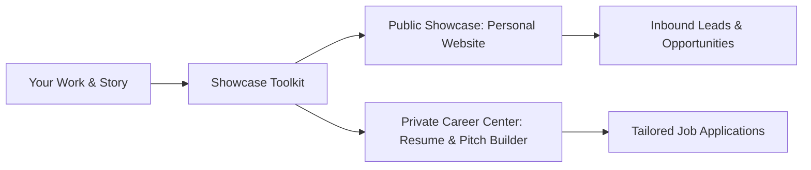

# Showcase: Personal Portfolio & Career Command Center

**Showcase** is an open, easy-to-use toolkit for personal portfolios and private career intelligence. It gives you and your friends a simple way to launch a high-craft personal website and run a private AI career command center.

---

## The Dual-Engine System

Showcase operates with two complementary engines:

1. **Engine 1: Public Showcase**: A clean, fast, accessible personal website that presents your work, case studies, and contact options.
2. **Engine 2: Private Career Center**: A private AI workspace (`.agents/career/`) that tailors resumes, writes pitch messages, and organizes your career stories.

---

## Key Features

- **2-Minute Guided Setup**: Answer 3 quick questions in plain English to set up your personal website and career center.
- **4 Visual Style Presets**: Choose between *Warm Editorial*, *Clean Minimal*, *Bold Creative*, or *Dark Studio*.
- **Non-Destructive Integration (Path A)**: Connect Showcase to your existing personal website without modifying or moving your source files.
- **Zero-Config Greenfield Starter (Path B)**: Launch a standalone, zero-dependency HTML5 portfolio that opens instantly in any browser.
- **One-Click Tailored Resumes**: Generate single-page vector PDFs, ATS plain-text copy buffers, and 80-word founder introduction notes.
- **Zero Technical Jargon**: Built for designers, copywriters, career switchers, and developers. No complex command-line syntax required.

---

## Command Quick Reference

| Command | Category | Purpose | Description |
| :--- | :--- | :--- | :--- |
| `/showcase init` | Setup | Start here | Sets up your website and career center in 3 simple steps. |
| `/showcase resume [job]` | Career | Apply to a job | Creates a tailored 1-page resume for a target role. |
| `/showcase pitch [name]` | Career | Contact a lead | Writes a friendly, 80-word introduction email or message. |
| `/showcase publish [work]` | Portfolio | Add a project | Turns notes or links into a clean case study. |
| `/showcase hunt [role]` | Career | Find opportunities | Matches your profile against open roles. |
| `/showcase polish [page]` | Design | Improve appearance | Audits spacing, typography, and contrast. |
| `/showcase profile` | Career | Update your story | Opens your master career notes to add new wins. |
| `/showcase preview` | Portfolio | View live work | Opens your portfolio in your local browser. |

---

---

## Toolkit Assets & Resources

Explore the core scripts, templates, schemas, and starter website:

- **AI Skill Assistant**: [Showcase Skill Definition](file:///c:/Users/ASUS/Documents/VSCode/jedmamosto-portfolio/showcase/skills/showcase/SKILL.md)
- **Greenfield Starter Website**: [Starter Portfolio Template](file:///c:/Users/ASUS/Documents/VSCode/jedmamosto-portfolio/showcase/skills/showcase/templates/starter-portfolio/index.html)
- **Core Automation Scripts**:
  - [Workspace Detector](file:///c:/Users/ASUS/Documents/VSCode/jedmamosto-portfolio/showcase/skills/showcase/scripts/detect_workspace.js)
  - [Workspace Initializer](file:///c:/Users/ASUS/Documents/VSCode/jedmamosto-portfolio/showcase/skills/showcase/scripts/init_workspace.js)
  - [Resume Compiler](file:///c:/Users/ASUS/Documents/VSCode/jedmamosto-portfolio/showcase/skills/showcase/scripts/compile_resume.js)
  - [Case Study Publisher](file:///c:/Users/ASUS/Documents/VSCode/jedmamosto-portfolio/showcase/skills/showcase/scripts/publish_case_study.js)
- **Data Schemas & ATS Guide**:
  - [Config Schema](file:///c:/Users/ASUS/Documents/VSCode/jedmamosto-portfolio/showcase/skills/showcase/references/config-schema.json)
  - [Career Profile Schema](file:///c:/Users/ASUS/Documents/VSCode/jedmamosto-portfolio/showcase/skills/showcase/references/profile-schema.json)
  - [Project Schema](file:///c:/Users/ASUS/Documents/VSCode/jedmamosto-portfolio/showcase/skills/showcase/references/project-schema.json)
  - [ATS Parsing Rules](file:///c:/Users/ASUS/Documents/VSCode/jedmamosto-portfolio/showcase/skills/showcase/references/ats-rules.md)
- **Document Templates**:
  - [Profile Template](file:///c:/Users/ASUS/Documents/VSCode/jedmamosto-portfolio/showcase/skills/showcase/templates/profile_template.md)
  - [Vector PDF Resume Template](file:///c:/Users/ASUS/Documents/VSCode/jedmamosto-portfolio/showcase/skills/showcase/templates/resume_template.html)
  - [80-Word Pitch Template](file:///c:/Users/ASUS/Documents/VSCode/jedmamosto-portfolio/showcase/skills/showcase/templates/pitch_template.md)

---

## Documentation & Architecture

Explore the architectural specifications, visual presets, and testing runbooks:

- [Subsystem Specifications Index](file:///c:/Users/ASUS/Documents/VSCode/jedmamosto-portfolio/showcase/docs/specs/index.md)
- [UX Strategy Blueprint](file:///c:/Users/ASUS/Documents/VSCode/jedmamosto-portfolio/showcase/docs/specs/showcase-ux-blueprint.md)
- [Visual Style Presets & Wireframes](file:///c:/Users/ASUS/Documents/VSCode/jedmamosto-portfolio/showcase/docs/specs/showcase-visual-presets.md)
- [System Architecture Specification](file:///c:/Users/ASUS/Documents/VSCode/jedmamosto-portfolio/showcase/docs/specs/showcase-system-architecture.md)
- [ADR-0001: Showcase Toolkit Architecture](file:///c:/Users/ASUS/Documents/VSCode/jedmamosto-portfolio/showcase/docs/adr/0001-showcase-toolkit-architecture.md)
- [Behavioral Verification Plan (BVP)](file:///c:/Users/ASUS/Documents/VSCode/jedmamosto-portfolio/showcase/docs/testing/showcase-bvp.md)
- [Master Implementation Plan](file:///c:/Users/ASUS/Documents/VSCode/jedmamosto-portfolio/showcase/docs/plans/showcase_implementation_plan.md)
- [Release Changelog](file:///c:/Users/ASUS/Documents/VSCode/jedmamosto-portfolio/showcase/CHANGELOG.md)

