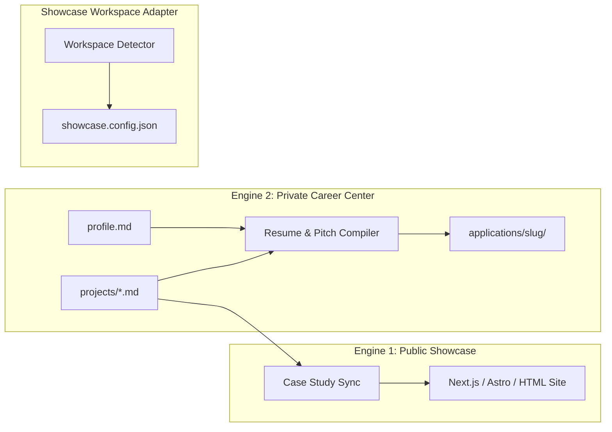

# ADR-0001: Showcase Toolkit Architecture

## 1. Context & Problem Statement
Engineers, designers, copywriters, and career switchers face two competing challenges:
1. Maintaining a high-craft public personal portfolio website without breaking code or wrestling with complex, expensive web builders.
2. Managing private career intelligence (resumes, job outreach, ATS copy) across fragmented folders and outdated documents.

Existing solutions either force vendor lock-in ($200+/yr website builders) or require deep command-line and Git expertise. We need an open, dual-engine toolkit that connects seamlessly to existing personal websites (Path A) or bootstraps zero-config starters (Path B) while safeguarding existing files.

## 2. Invariant Rules & Boundaries (ASD-STE100)
- DO NOT modify, overwrite, or delete existing website source files during workspace setup.
- ALWAYS isolate private career assets under `.agents/career/` with structured schemas.
- DO NOT use loose types (`any`, unvalidated JSON) in career contracts.
- ALWAYS enforce strict schemas for profile frontmatter, project case studies, and toolkit configuration.
- DO NOT expose raw terminal syntax, Git branching, or AST parsing errors to non-technical users.
- ALWAYS provide plain CEFR A2 English feedback and NN/g 3-part recovery actions.

## 3. Decision
We adopt the **Dual-Engine Architecture** for the `showcase` toolkit:
1. **Public Showcase (Engine 1)**: Presents public case studies, credentials, and contact triggers via modern static/SSR web runtimes (Next.js, Astro, or static HTML).
2. **Private Career Center (Engine 2)**: AI-driven career hub in `.agents/career/` storing `profile.md`, case studies, and tailored application packages (`applications/<slug>/`).
3. **Workspace Adapter Layer**: Detects existing personal portfolio websites (Path A) vs empty project folders (Path B) non-destructively, persisting configuration in `showcase.config.json`.

## 4. Rationale & Alternatives Considered

| Option Considered | Wins | Losses | Decision |
| :--- | :--- | :--- | :--- |
| **Dual-Engine Architecture with `.agents/career/` (Chosen)** | 100% data ownership, non-destructive to existing sites, zero-lockin, offline-first | Requires workspace folder initialization | **Accepted** |
| **SaaS Cloud Platform** | Central database, web dashboard | Subscription costs, privacy loss, vendor lock-in | Rejected |
| **Monolithic Single File (`resume.json`)** | Single file simplicity | Poor human readability, difficult for rich markdown stories | Rejected |
| **Git-Branch Based Separation** | Branch isolation | Overwhelming cognitive load for non-developers | Rejected |

## 5. Consequences & Downstream Impact
- **Positive Impact**: Non-destructive setup guarantees zero risk for active personal portfolios; single source of truth for resume tailoring and job outreach.
- **Negative / Trade-off Impact**: Requires the agent framework to parse markdown frontmatter and maintain sync adapters across diverse web frameworks.
- **Verification Plan**: Run test suite in [showcase-bvp.md](file:///c:/Users/ASUS/Documents/VSCode/jedmamosto-portfolio/showcase/docs/testing/showcase-bvp.md) verifying Path A detection on existing repos and Path B scaffolding in empty directories.
