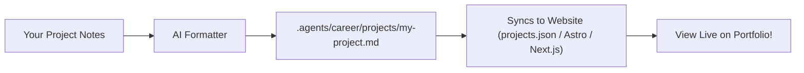

# User Guide: Publishing Case Studies

**Audience**: All Users | **Standard**: CEFR A2 Plain English | **Line Budget**: ≤ 150 lines  
**Documentation Hub**: [Documentation Index](file:///c:/Users/ASUS/Documents/VSCode/jedmamosto-portfolio/showcase/docs/index.md)

---

## 1. Why Case Studies Matter

A great portfolio presents real proof of your work. Showcase formats your project notes into structured case studies with:
- **Challenge & Problem**: What needed to be solved.
- **Your Role & Action**: What you built or designed.
- **Results & Metrics**: Concrete numbers (e.g. "+18% conversion lift", "200 daily active users").

---

## 2. How to Add a Project

Run the command in your chat window:

```text
/showcase publish [paste link or type project notes]
```

### Example Input:
```text
/showcase publish Redesigned the checkout flow for an online store in Figma. Increased mobile checkout completion by 18%.
```

---

## 3. What Showcase Does Automatically



1. **Creates Career Record**: Saves a structured Markdown file in `.agents/career/projects/<slug>.md`.
2. **Updates Public Website**: Updates your website data file (`data/projects.json` for starter sites, or your custom adapter for Next.js / Astro).
3. **Displays Live**: The project appears immediately on your public portfolio page.

---

## 4. Editing or Removing Projects

- **To edit a project**: Open `.agents/career/projects/<slug>.md` and edit the text.
- **To feature a project at the top**: Set `isFeatured: true` in the project's header notes.
- **To remove a project**: Delete the markdown file and run `/showcase preview`.
