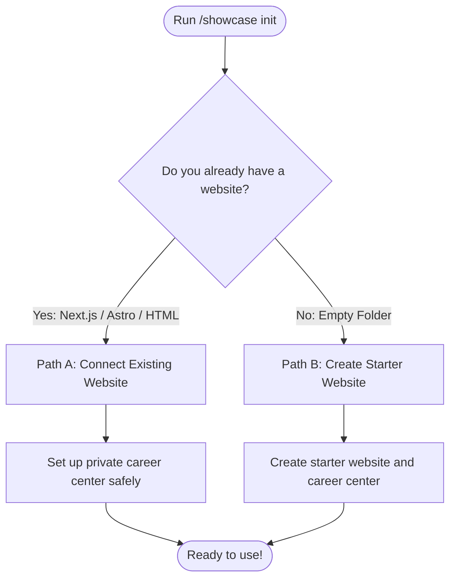

# Quickstart: 2-Minute Setup Guide

**Audience**: All Users | **Standard**: CEFR A2 Plain English | **Line Budget**: ≤ 150 lines  
**Documentation Hub**: [Documentation Index](file:///c:/Users/ASUS/Documents/VSCode/jedmamosto-portfolio/showcase/docs/index.md)

---

## 1. What is Showcase?

**Showcase** gives you two simple tools in one package:
1. **A Public Website**: A fast, beautiful personal portfolio to show your work and contact details.
2. **A Private Career Center**: A private folder on your computer (`.agents/career/`) where AI helps you tailor resumes, write pitch emails, and organize your work history.

---

## 2. Installation & Setup

Choose one of three easy ways to install:

- **With AI Assistant**: Clone into your `.agents/skills/` folder:
  ```bash
  git clone https://github.com/jedm-dev/showcase.git .agents/skills/showcase
  ```
- **With Node.js CLI**: Run `node skills/showcase/scripts/init_workspace.js` in your terminal.
- **No-Code / Instant**: Open `skills/showcase/templates/starter-portfolio/index.html` in your browser.

---

## 3. Launching in 2 Minutes

Run the setup command in your chat window:

```text
/showcase init
```

The assistant will inspect your folder and ask 3 quick questions:



---

## 4. Which Path Fits You?

### Path A: You Already Have a Website
If you have an existing portfolio (like Next.js, Astro, or HTML):
- **Safety Guarantee**: Showcase will **never delete or change** your existing website files.
- **What happens**: Showcase creates a private `.agents/career/` folder for your resumes and saves your settings in `showcase.config.json`.

### Path B: You Are Starting from Scratch
If you do not have a website yet:
- **Instant Starter**: Showcase creates a complete, modern HTML5 portfolio in your folder.
- **Zero Build Tools**: No terminal setup or `npm install` needed. You can double-click `index.html` to open it immediately in your browser.

---

## 5. What to Do Next

Once setup is complete, you can use these simple commands:

| Action | Command | What It Does |
| :--- | :--- | :--- |
| **Apply to a Job** | `/showcase resume [job]` | Creates a tailored 1-page PDF resume and ATS text for a target role. |
| **Email a Lead** | `/showcase pitch [name]` | Writes a friendly, 80-word introduction email. |
| **Add a Project** | `/showcase publish [notes]` | Formats your notes into a clean project case study. |
| **View Website** | `/showcase preview` | Opens your portfolio in your local web browser. |
| **Update History** | `/showcase profile` | Opens your master career notes to add new wins. |
