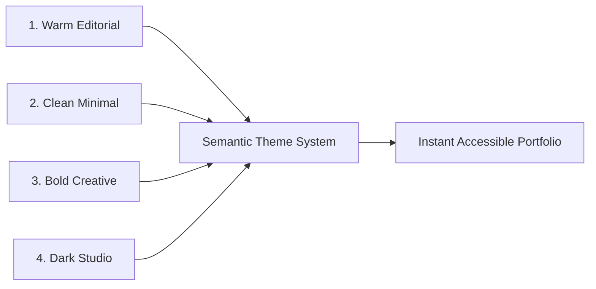

# User Guide: Visual Themes & Customization

**Audience**: All Users | **Standard**: CEFR A2 Plain English | **Line Budget**: ≤ 150 lines  
**Documentation Hub**: [Documentation Index](file:///c:/Users/ASUS/Documents/VSCode/jedmamosto-portfolio/showcase/docs/index.md)

---

## 1. The 4 Visual Style Presets

Showcase includes four visual style presets. Each preset offers high contrast, readable typography, and clean layouts:



---

## 2. Preset Descriptions

### 1. Warm Editorial
- **Look & Feel**: Warm off-white paper canvas, elegant serif headings, calm feeling.
- **Best For**: Writers, researchers, consultants, and strategists.
- **Headings Font**: `Newsreader` or `Lora` (Serif).

### 2. Clean Minimal
- **Look & Feel**: Bright white background, sharp black text, crisp geometric lines.
- **Best For**: Product designers, UX leads, and project managers.
- **Headings Font**: `Hanken Grotesk` or `Inter` (Sans-Serif).

### 3. Bold Creative
- **Look & Feel**: Soft lilac canvas with vibrant purple accents and modern wide fonts.
- **Best For**: Visual artists, brand designers, and animators.
- **Headings Font**: `Syne` or `Space Grotesk` (Expressive Sans-Serif).

### 4. Dark Studio
- **Look & Feel**: Deep charcoal background, sleek glass cards, glowing green status badge.
- **Best For**: Engineers, AI developers, and technical founders.
- **Headings Font**: `Geist Sans` or `Inter` (Modern Sans-Serif).

---

## 3. How to Change Your Theme

You can switch your visual style anytime:

### Method 1: Change in HTML
Open `index.html` and change the `data-theme` attribute on the first line:

```html
<html lang="en" data-theme="dark-studio">
```

Choose from: `warm-editorial`, `clean-minimal`, `bold-creative`, or `dark-studio`.

### Method 2: Use the AI Assistant
Type in your chat:
```text
/showcase polish
```
The assistant will help you preview and apply a new style.

---

## 4. Accessibility & Contrast Guarantee

All themes follow **WCAG AA and AAA accessibility standards**:
- Body text is dark and easy to read on light themes.
- Headlines stand out with high contrast.
- Buttons have clear focus outlines when using keyboard navigation.
