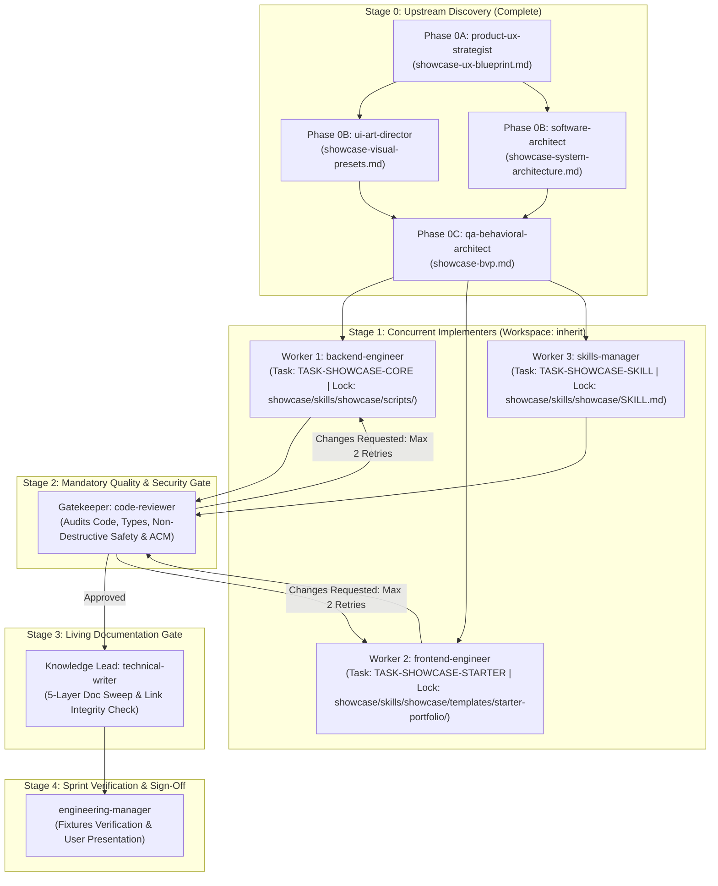

# Master Implementation Plan: Showcase Personal Portfolio & Career Command Center
- **Orchestrator**: Lead Orchestrator (`engineering-manager`)
- **Target Workspace**: `c:/Users/ASUS/Documents/VSCode/jedmamosto-portfolio/showcase/`
- **Feature Branch**: `feature/showcase-toolkit-core`
- **Target Milestone**: v1.0.0 (Core Engine & Starter Template)
- **Living Document URI**: [showcase_implementation_plan.md](file:///c:/Users/ASUS/Documents/VSCode/jedmamosto-portfolio/showcase/docs/plans/showcase_implementation_plan.md)

---

## 1. Executive Summary & Plain-English Mental Model

### What This Does in Everyday Terms (CEFR A2)
**Showcase** gives you and your friends a complete personal portfolio and a private AI career assistant in one simple package:
1. **Public Website**: A clean, modern website where visitors can learn about you, see your projects, and contact you.
2. **Private Career Center**: A private folder (`.agents/career/`) where AI helps you tailor resumes, write introduction notes, and find jobs in seconds.

### Business Goal & User Outcomes
- **Outcome 1 (Safe Integration)**: If a user already has a personal website (Path A), Showcase connects safely without deleting or altering any files.
- **Outcome 2 (Instant Starter)**: If a user has no website (Path B), Showcase creates a clean portfolio with 4 beautiful visual styles in under 2 minutes.
- **Outcome 3 (Non-Developer Friendly)**: Zero terminal or code jargon. Simple 3-question setup with 1-click error fixes.
- **Blast Radius**: Isolated entirely to `showcase/` workspace and target user projects upon explicit setup.

---

## 2. Multi-Agent DAG Execution Topology



---

## 3. Subagent Task Allocation Matrix

Every subagent MUST inspect this matrix at Step 1 to understand its bounded scope, lock paths, and dependencies:

| Subagent ID | Assigned Role | Task ID | Exclusive Subsystem Lock Paths (Write Mutex) | Upstream Inputs | Downstream Dependents | Acceptance Criteria |
| :--- | :--- | :--- | :--- | :--- | :--- | :--- |
| **Worker 1** | `backend-engineer` | `TASK-SHOWCASE-CORE` | `showcase/skills/showcase/scripts/`<br>`showcase/skills/showcase/references/`<br>`showcase/skills/showcase/templates/` (excl. starter) | Stage 0 Specs & BVP | `code-reviewer` | `AC-001` to `AC-005`<br>`AC-011` to `AC-015` |
| **Worker 2** | `frontend-engineer` | `TASK-SHOWCASE-STARTER` | `showcase/skills/showcase/templates/starter-portfolio/` | Stage 0 Visual Presets | `code-reviewer` | `AC-006` to `AC-010`<br>WCAG AA/AAA OKLCH |
| **Worker 3** | `skills-manager` | `TASK-SHOWCASE-SKILL` | `showcase/skills/showcase/SKILL.md`<br>`showcase/package.json` | Stage 0 UX Blueprint & Architecture | `code-reviewer` | Level 1/2 Skill Triggers<br>CEFR A2 Router |
| **Gatekeeper** | `code-reviewer` | `TASK-SHOWCASE-REV` | Read-Only (Full Workspace Diffs) | Worker 1, 2, 3 Memos | `technical-writer` | 100% ACM Pass, 0 Syntax Errors, Zero Deletion verified |
| **Knowledge Lead** | `technical-writer` | `TASK-SHOWCASE-DOC` | `showcase/docs/`, `showcase/README.md` | `code-reviewer` Approval | `engineering-manager` | 5-Layer Doc Sync, 100% `file:///` Link Integrity |

---

## 4. Stage 0 Specification Anchors

All implementers MUST ground their game plans against signed-off Stage 0 specs:
- **UX Strategy Blueprint**: [showcase-ux-blueprint.md](file:///c:/Users/ASUS/Documents/VSCode/jedmamosto-portfolio/showcase/docs/specs/showcase-ux-blueprint.md)
- **Visual Style Presets & Wireframes**: [showcase-visual-presets.md](file:///c:/Users/ASUS/Documents/VSCode/jedmamosto-portfolio/showcase/docs/specs/showcase-visual-presets.md)
- **System Architecture Specification**: [showcase-system-architecture.md](file:///c:/Users/ASUS/Documents/VSCode/jedmamosto-portfolio/showcase/docs/specs/showcase-system-architecture.md)
- **Architecture Decision Record**: [0001-showcase-toolkit-architecture.md](file:///c:/Users/ASUS/Documents/VSCode/jedmamosto-portfolio/showcase/docs/adr/0001-showcase-toolkit-architecture.md)
- **Behavioral Verification Plan (BVP)**: [showcase-bvp.md](file:///c:/Users/ASUS/Documents/VSCode/jedmamosto-portfolio/showcase/docs/testing/showcase-bvp.md)

---

## 5. Subsystem Scope & Domain Mandates

### Subsystem 1: Core Automation Scripts & Schemas (`TASK-SHOWCASE-CORE`)
- **Domain Mandate**: Implement the workspace inspection engine, non-destructive initializers, resume/pitch compiler, and strict JSON schemas.
- **Lock Boundary**: `showcase/skills/showcase/scripts/`, `showcase/skills/showcase/references/`, `showcase/skills/showcase/templates/`
- **Key Modules**:
  - `scripts/detect_workspace.js`: Non-destructive inspector (detects Next.js, Astro, Vite, HTML).
  - `scripts/init_workspace.js`: Safely injects `.agents/career/` and `profile.md` with `.bak.<ts>` backups.
  - `scripts/compile_resume.js`: Compiles 1-page vector PDF, plain-text ATS copy, and 80-word founder note.
  - `scripts/publish_case_study.js`: Syncs new project stories to target website schema.
  - `references/`: `config-schema.json`, `profile-schema.json`, `project-schema.json`, `ats-rules.md`.
  - `templates/`: `profile_template.md`, `resume_template.html`, `pitch_template.md`.

### Subsystem 2: Greenfield Starter Portfolio (`TASK-SHOWCASE-STARTER`)
- **Domain Mandate**: Build the zero-dependency semantic HTML5/CSS starter portfolio template with 4 WCAG AA style presets.
- **Lock Boundary**: `showcase/skills/showcase/templates/starter-portfolio/`
- **Key Modules**:
  - `index.html`: Accessible semantic structure (Header, Hero, Featured Projects, About/Narrative, Contact).
  - `styles/theme.css`: Semantic OKLCH tokens for 4 presets (*Warm Editorial*, *Clean Minimal*, *Bold Creative*, *Dark Studio*).
  - `styles/layout.css`: Responsive typography clamp scales and fluid grid system.
  - `scripts/app.js`: Local project card renderer and theme toggle.
  - `data/projects.json`: Starter project case studies.

### Subsystem 3: Showcase Antigravity Skill Definition (`TASK-SHOWCASE-SKILL`)
- **Domain Mandate**: Author the Antigravity Skill router and package manifest.
- **Lock Boundary**: `showcase/skills/showcase/SKILL.md`, `showcase/package.json`
- **Key Modules**:
  - `SKILL.md`: Level 1 YAML frontmatter + Level 2 interactive command dispatcher (`/showcase`, `/showcase init`, `/showcase resume`, etc.).
  - Error recovery handlers (NN/g 3-part microcopy) and CEFR A2 dialogue patterns.

---

## 6. Unified Verification Plan & Quality Gates

### Deterministic Verification Suite
```powershell
# Verification commands executed in showcase/
Cwd: "c:\Users\ASUS\Documents\VSCode\jedmamosto-portfolio\showcase"
npm test
```

### Mandatory Subagent Directives
1. **Step 1 Master Plan & Stack Ingestion**: Execute `view_file` on this Master Plan, assigned `SKILL.md`, and relevant specs before taking action.
2. **Collaborative Game Plan Huddle**: Submit your game plan via `send_message` showing: (a) How your task satisfies its assigned Task ID and Acceptance Criteria, (b) Proposed file changes ([NEW], [MODIFY], [DELETE]), and (c) How your interfaces prepare downstream workers. Wait for explicit `"APPROVED"` before writing code.
3. **Native Disk Tools**: Use `write_to_file` and `replace_file_content`. Never create helper shell scripts.
4. **2-Retry Circuit Breaker**: Implementers have a maximum of 2 self-repair attempts if tests or reviews fail.
