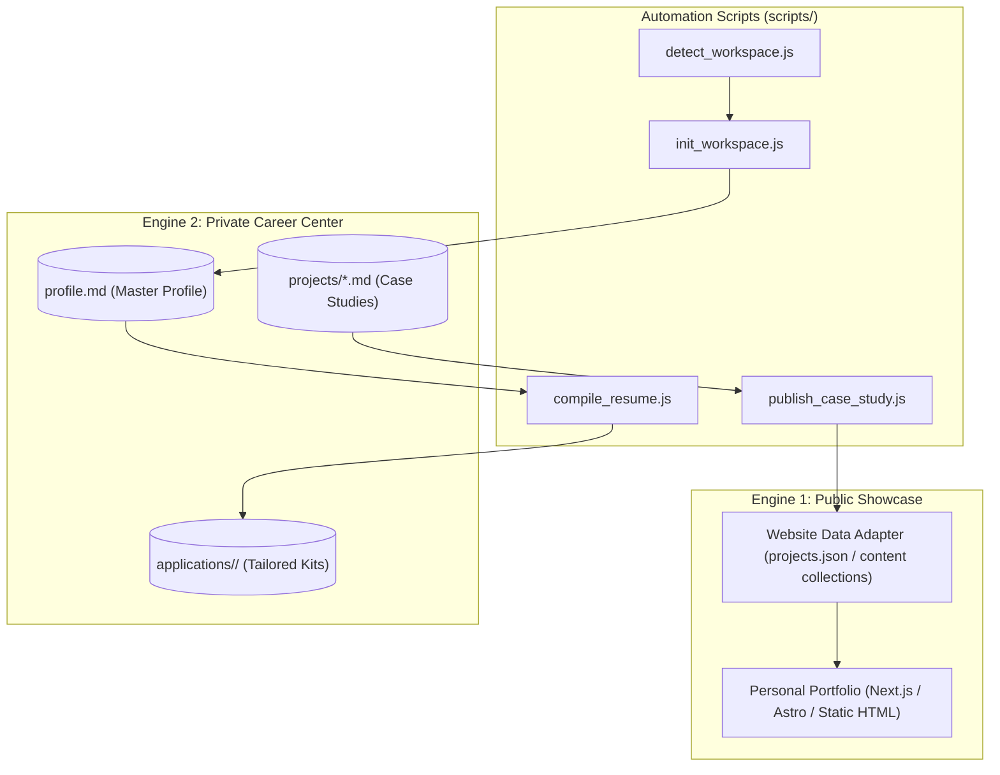

# Architecture Reference: Dual-Engine System

**Standard**: ASD-STE100 & Strict TypeScript | **Line Budget**: ≤ 150 lines  
**Documentation Hub**: [Documentation Index](file:///c:/Users/ASUS/Documents/VSCode/jedmamosto-portfolio/showcase/docs/index.md)

---

## 1. System Topology

Showcase separates public presentation from private career data using a **Dual-Engine Architecture**:



---

## 2. Non-Destructive Invariant

The setup engine guarantees zero data loss on existing repositories:
- **No Overwrites**: Original source files are never deleted or renamed.
- **Safety Backups**: Before modifying any existing configuration or project list, the engine creates a timestamped `.bak.<YYYYMMDD_HHMMSS>` backup file.
- **Isolated Career Directory**: All career data is stored strictly in `.agents/career/`.

---

## 3. Directory Structure

```text
showcase/
├── README.md                      # Public overview and quickstart
├── CHANGELOG.md                   # Semantic Versioning release notes
├── package.json                   # Dependencies and test commands
├── docs/                          # Guides and technical reference
│   ├── index.md                   # Master documentation index
│   ├── guides/                    # User guides (CEFR A2)
│   └── reference/                 # Developer reference (ASD-STE100)
└── skills/showcase/               # Antigravity skill package
    ├── SKILL.md                   # Command router and triggers
    ├── references/                # JSON schemas and ATS compliance rules
    ├── scripts/                   # Automation scripts
    └── templates/                 # Templates and starter portfolio
```
