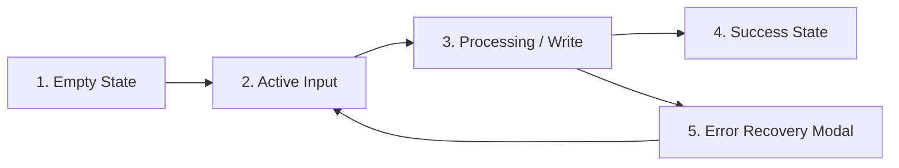

# Technical Reference: Command Router & Error Recovery

**Standard**: ASD-STE100 & CEFR A2 | **Line Budget**: ≤ 150 lines  
**Documentation Hub**: [Documentation Index](file:///c:/Users/ASUS/Documents/VSCode/jedmamosto-portfolio/showcase/docs/index.md)

---

## 1. Master Command Directory

The Showcase skill router (`SKILL.md`) routes user commands to internal scripts:

| Command | Subsystem Triggered | Script / Module | Observable Output |
| :--- | :--- | :--- | :--- |
| `/showcase` | Menu / Router | `detect_workspace.js` | Interactive action menu or setup invitation |
| `/showcase init` | Workspace Setup | `init_workspace.js` | `showcase.config.json` & `.agents/career/` |
| `/showcase resume [job]` | Application Kit | `compile_resume.js` | 1-page PDF, ATS text, & pitch note |
| `/showcase pitch [name]` | Direct Outreach | `compile_resume.js` | 80-word introduction pitch note |
| `/showcase publish [notes]` | Case Study Sync | `publish_case_study.js` | `.agents/career/projects/<slug>.md` |
| `/showcase hunt [role]` | Opportunity Scout | `job-hunter` skill | Ranked list of verified job leads |
| `/showcase polish [page]` | Design System | OKLCH theme engine | Updated CSS variables & contrast report |
| `/showcase profile` | Career Hub | Interactive prompt | Updated `.agents/career/profile.md` |
| `/showcase preview` | Local Preview | Local HTTP / browser | Browser opens portfolio index |

---

## 2. 5-State Finite State Machine (FSM)

All commands transition deterministically across 5 interaction states:

---

## 3. NN/g 3-Part Error Recovery Model

Every error response follows the Nielsen Norman Group 3-part microcopy standard:
1. **What happened**: Plain statement of the condition without raw exception stack traces.
2. **Why it happened**: Clear explanation of the underlying cause.
3. **Recovery CTA**: Actionable button with explicit `[Verb + Object]` label (e.g. `[Choose Another Folder]`, `[Paste Job Text Directly]`).
