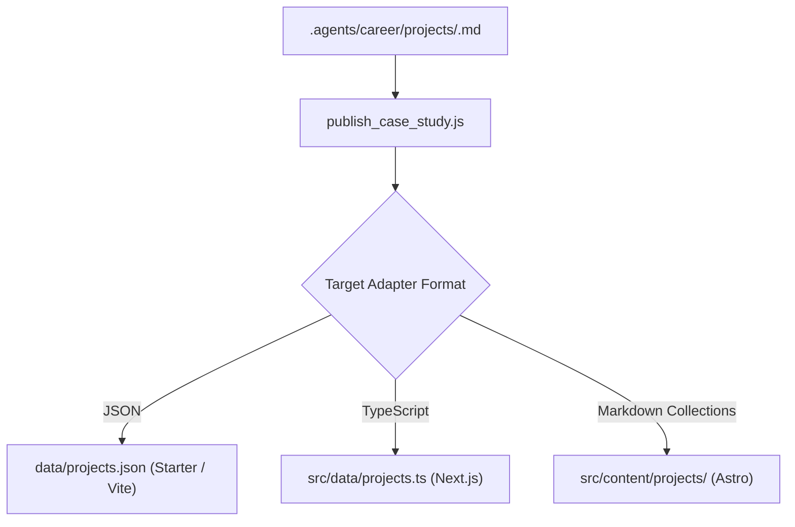

# Technical Reference: Framework Adapters

**Standard**: ASD-STE100 & Strict TypeScript | **Line Budget**: ≤ 150 lines  
**Documentation Hub**: [Documentation Index](file:///c:/Users/ASUS/Documents/VSCode/jedmamosto-portfolio/showcase/docs/index.md)

---

## 1. Adapter Architecture

The `publish_case_study.js` script syncs structured case studies to various web framework formats:



---

## 2. Supported Frameworks & Detection Heuristics

The workspace inspector (`detect_workspace.js`) identifies framework signatures:

| Framework | Detection Signature | Adapter Format | Target Data Path |
| :--- | :--- | :--- | :--- |
| **Greenfield Starter** | `starter-portfolio/` scaffold | `json` | `data/projects.json` |
| **Next.js** | `next.config.js\|ts` or `"next"` in `package.json` | `typescript` or `json` | `src/data/projects.ts` |
| **Astro** | `astro.config.mjs\|ts` or `"astro"` in `package.json` | `markdown-collections` | `src/content/projects/` |
| **Vite / Static HTML**| `vite.config.js` or `index.html` | `json` or `html` | `data/projects.json` |

---

## 3. Creating a Custom Adapter

To integrate Showcase with custom website generators, specify the custom path in `showcase.config.json`:

```json
{
  "mode": "existing-portfolio",
  "framework": "custom",
  "adapter": {
    "format": "json",
    "projectDataFile": "public/data/portfolio.json"
  }
}
```

The sync engine will read the frontmatter of all files in `.agents/career/projects/` and write a serialized JSON array directly to your specified `projectDataFile`.
