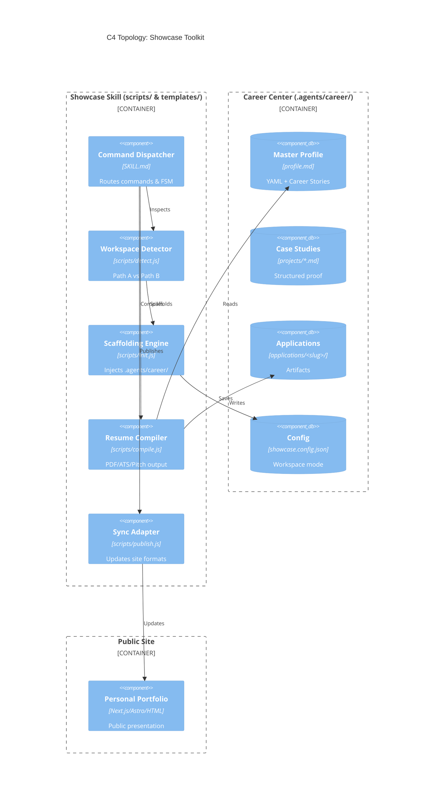
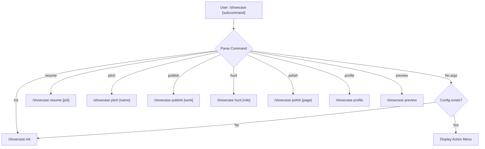
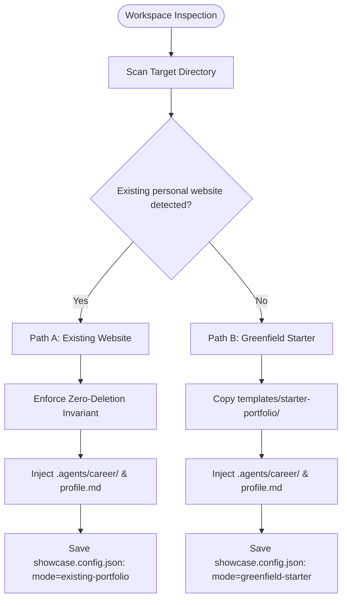
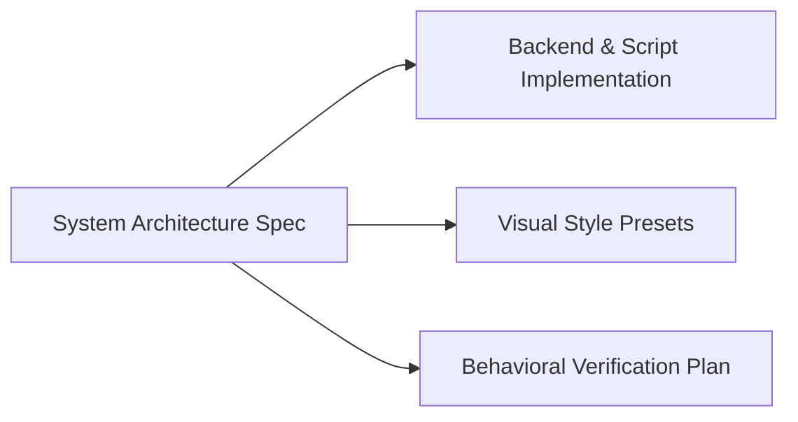

# Showcase Toolkit: System Architecture Specification

**Status**: APPROVED | **Standard**: ASD-STE100 & Strict TypeScript | **Target**: `showcase/docs/specs/showcase-system-architecture.md`  
**Companion ADR**: [ADR-0001: Showcase Toolkit Architecture](file:///c:/Users/ASUS/Documents/VSCode/jedmamosto-portfolio/showcase/docs/adr/0001-showcase-toolkit-architecture.md) | **UX Blueprint**: [showcase-ux-blueprint.md](file:///c:/Users/ASUS/Documents/VSCode/jedmamosto-portfolio/showcase/docs/specs/showcase-ux-blueprint.md)

---

## 1. System Topology & C4 Component Model

The `showcase` toolkit operates as a **Dual-Engine System**:
- **Engine 1 (Public Showcase)**: High-craft personal web portfolio (Next.js, Astro, or static HTML).
- **Engine 2 (Private Career Center)**: AI career intelligence workspace in `.agents/career/`.



### Toolkit Package Anatomy (Antigravity 3-Level Standard)
- **Root**: [`README.md`](file:///c:/Users/ASUS/Documents/VSCode/jedmamosto-portfolio/showcase/README.md) (Quickstart), [`CHANGELOG.md`](file:///c:/Users/ASUS/Documents/VSCode/jedmamosto-portfolio/showcase/CHANGELOG.md) (SemVer 2.0.0), [`package.json`](file:///c:/Users/ASUS/Documents/VSCode/jedmamosto-portfolio/showcase/package.json) (Scripts).
- **Docs**: [`docs/specs/index.md`](file:///c:/Users/ASUS/Documents/VSCode/jedmamosto-portfolio/showcase/docs/specs/index.md), [`ADR-0001`](file:///c:/Users/ASUS/Documents/VSCode/jedmamosto-portfolio/showcase/docs/adr/0001-showcase-toolkit-architecture.md), [`BVP`](file:///c:/Users/ASUS/Documents/VSCode/jedmamosto-portfolio/showcase/docs/testing/showcase-bvp.md).
- **Level 3 Assets (`skills/showcase/`)**:
  - Schemas: [`config-schema.json`](file:///c:/Users/ASUS/Documents/VSCode/jedmamosto-portfolio/showcase/skills/showcase/references/config-schema.json), [`profile-schema.json`](file:///c:/Users/ASUS/Documents/VSCode/jedmamosto-portfolio/showcase/skills/showcase/references/profile-schema.json), [`project-schema.json`](file:///c:/Users/ASUS/Documents/VSCode/jedmamosto-portfolio/showcase/skills/showcase/references/project-schema.json), [`ats-rules.md`](file:///c:/Users/ASUS/Documents/VSCode/jedmamosto-portfolio/showcase/skills/showcase/references/ats-rules.md).
  - Scripts: [`detect_workspace.js`](file:///c:/Users/ASUS/Documents/VSCode/jedmamosto-portfolio/showcase/skills/showcase/scripts/detect_workspace.js), [`init_workspace.js`](file:///c:/Users/ASUS/Documents/VSCode/jedmamosto-portfolio/showcase/skills/showcase/scripts/init_workspace.js), [`compile_resume.js`](file:///c:/Users/ASUS/Documents/VSCode/jedmamosto-portfolio/showcase/skills/showcase/scripts/compile_resume.js), [`publish_case_study.js`](file:///c:/Users/ASUS/Documents/VSCode/jedmamosto-portfolio/showcase/skills/showcase/scripts/publish_case_study.js).
  - Templates: [`profile_template.md`](file:///c:/Users/ASUS/Documents/VSCode/jedmamosto-portfolio/showcase/skills/showcase/templates/profile_template.md), [`resume_template.html`](file:///c:/Users/ASUS/Documents/VSCode/jedmamosto-portfolio/showcase/skills/showcase/templates/resume_template.html), [`pitch_template.md`](file:///c:/Users/ASUS/Documents/VSCode/jedmamosto-portfolio/showcase/skills/showcase/templates/pitch_template.md), [`starter-portfolio/`](file:///c:/Users/ASUS/Documents/VSCode/jedmamosto-portfolio/showcase/skills/showcase/templates/starter-portfolio/index.html).

---

## 2. Command Dispatch & Execution Engine



| Command | Action | Required Input | Outputs |
| :--- | :--- | :--- | :--- |
| `/showcase init` | Inspects workspace & runs 2-3 step interview | Bio & style choice | `showcase.config.json`, `.agents/career/profile.md` |
| `/showcase resume` | Tailors 1-page resume for target job | Job text or URL | `resume_<co>.pdf`, `resume_<co>_ats.txt`, `pitch.md` |
| `/showcase pitch` | Generates 80-word targeted intro note | Contact name & role | `application_pitch.md` |
| `/showcase publish` | Formats raw work into structured case study | Notes / URL | `.agents/career/projects/<slug>.md` & site sync |
| `/showcase hunt` | Matches profile against opportunity types | Role keywords | Ranked lead list in chat |
| `/showcase polish` | Audits accessibility & applies theme tokens | Target page / theme | Updated theme CSS tokens |
| `/showcase profile` | Guided update of master career notes | Achievement notes | Updated `.agents/career/profile.md` |
| `/showcase preview` | Launches local preview of public site | None | Local browser preview |

---

## 3. Standardized Data Contracts (TypeScript Interfaces)

```typescript
export interface ShowcaseConfig {
  schemaVersion: '1.0.0';
  mode: 'existing-portfolio' | 'greenfield-starter';
  framework: 'nextjs' | 'astro' | 'vite' | 'html-static' | 'remix' | 'nuxt' | 'sveltekit' | 'custom';
  portfolioDir: string; // e.g. "personal-portfolio" or "."
  careerDir: string; // default: ".agents/career"
  theme: 'warm-editorial' | 'clean-minimal' | 'bold-creative' | 'dark-studio';
  exportTargets: { pdf: boolean; atsText: boolean; pitchNote: boolean };
  contact: { email: string; linkedin?: string; bookingUrl?: string; github?: string; website?: string };
  adapter?: { projectDataFile?: string; format: 'typescript' | 'json' | 'markdown-collections' | 'html' };
}

export interface ProfileMetric { label: string; value: string; context: string; }
export interface ProfileContact {
  fullName: string; headline: string; location: string; email: string;
  phone?: string; website?: string; linkedin?: string; github?: string;
}

export interface MasterCareerProfileFrontmatter {
  schemaVersion: '1.0.0';
  contact: ProfileContact;
  targetRoles: string[];
  coreCompetencies: { domain: string[]; technical: string[]; tools: string[] };
  featuredProjectSlugs: string[];
  keyMetrics: ProfileMetric[];
  lastUpdated: string; // ISO 8601
}

export interface CaseStudyFrontmatter {
  slug: string;
  title: string;
  tagline: string;
  category: 'UX Design' | 'FinTech' | 'AI Product' | 'Engineering' | 'Content Strategy' | string;
  role: string;
  organization: string;
  timeframe: string;
  status: 'Production' | 'Live' | 'Active Development' | 'Concept' | 'Case Study';
  statusBadge: string;
  isFeatured: boolean;
  featuredRank?: number;
  liveUrl?: string;
  githubUrl?: string;
  stack: string[];
  metrics: Array<{ label: string; value: string; detail?: string }>;
  videos?: { productDemoUrl?: string; workflowDemoUrl?: string };
}
```

---

## 4. Non-Destructive Workspace Scaffolding Logic



### Detection Heuristics & Safety Guarantees
1. **Next.js**: Matches `next.config.js|mjs|ts` OR `"next"` in `package.json`. Sets `adapter.format = "typescript"|"json"`.
2. **Astro**: Matches `astro.config.mjs|ts` OR `"astro"` in `package.json`. Sets `adapter.format = "markdown-collections"`.
3. **Vite / Static HTML**: Matches `vite.config.*` or `index.html`. Sets `adapter.format = "json"|"html"`.
4. **Standalone Personal Portfolio Isolation**: Scans target folder without modifying existing components, styling, or scripts.
5. **Zero Deletion Invariant**: Never delete or rename existing code. Write timestamped backups (`.bak.<ts>`) before sync.

---

## 5. Greenfield Starter Portfolio Specification (Path B)

```text
starter-portfolio/
├── index.html        # Semantic HTML5 single-page portfolio with fluid clamp() typography
├── styles/           # Modern CSS with 4 WCAG AA themes (Warm Editorial, Clean Minimal, Bold Creative, Dark Studio)
├── scripts/          # Theme switcher, project card renderer, contact trigger
├── data/projects.json# Static JSON mirror synced from .agents/career/projects/
└── README.md         # 2-step launch guide: double-click index.html or deploy to Vercel/Netlify
```
- **Zero Build Dependencies**: Runs in any browser instantly without `npm install`.

---

## 6. Downstream Specialist Handoffs


1. **Engineering Implementation**: Implement `detect_workspace.js`, `init_workspace.js`, and `compile_resume.js`.
2. **Visual Design**: Reference [showcase-visual-presets.md](file:///c:/Users/ASUS/Documents/VSCode/jedmamosto-portfolio/showcase/docs/specs/showcase-visual-presets.md) for WCAG 2.1 AA/AAA theme token definitions across the 4 visual presets.
3. **Quality Verification**: Reference [showcase-bvp.md](file:///c:/Users/ASUS/Documents/VSCode/jedmamosto-portfolio/showcase/docs/testing/showcase-bvp.md) to validate Path A isolation on existing personal sites and Path B in empty directories.
