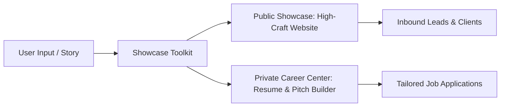
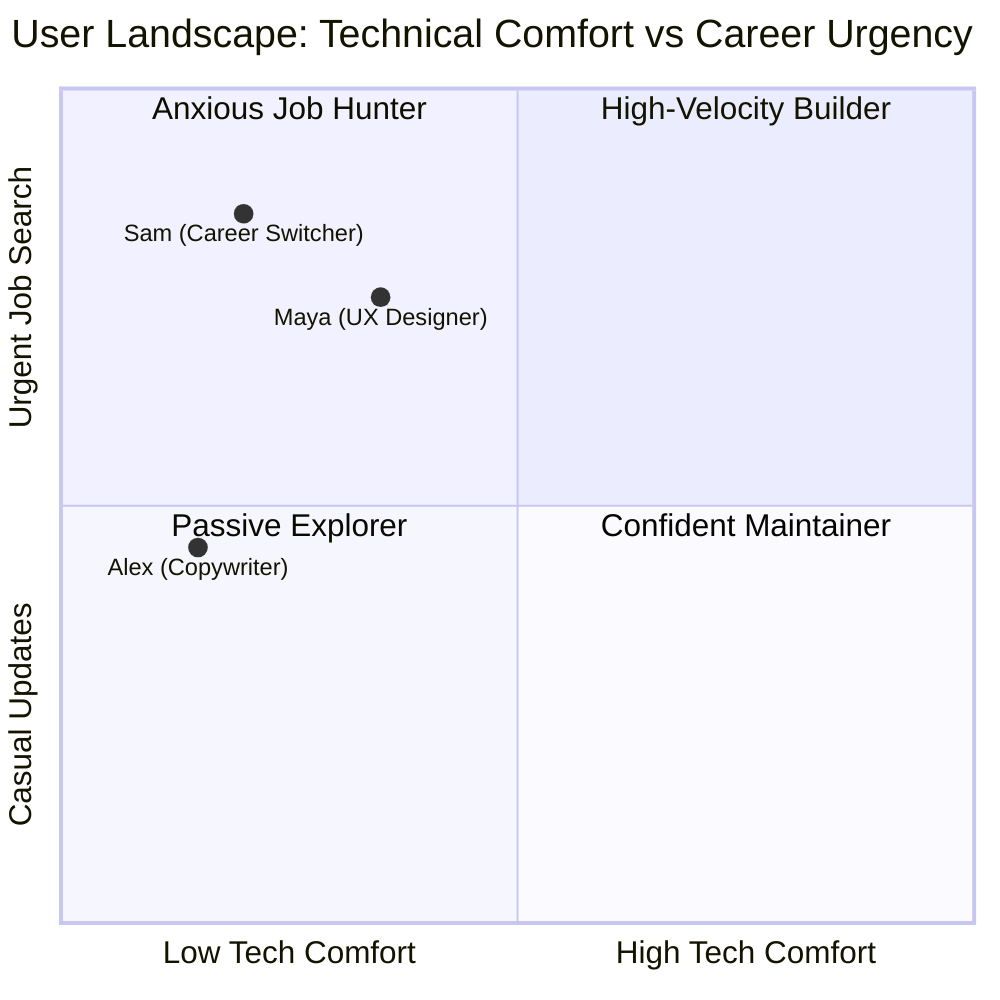
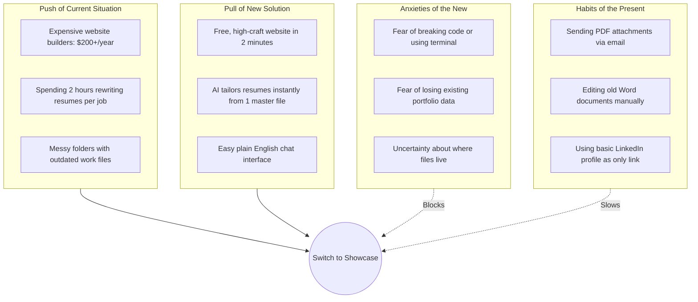
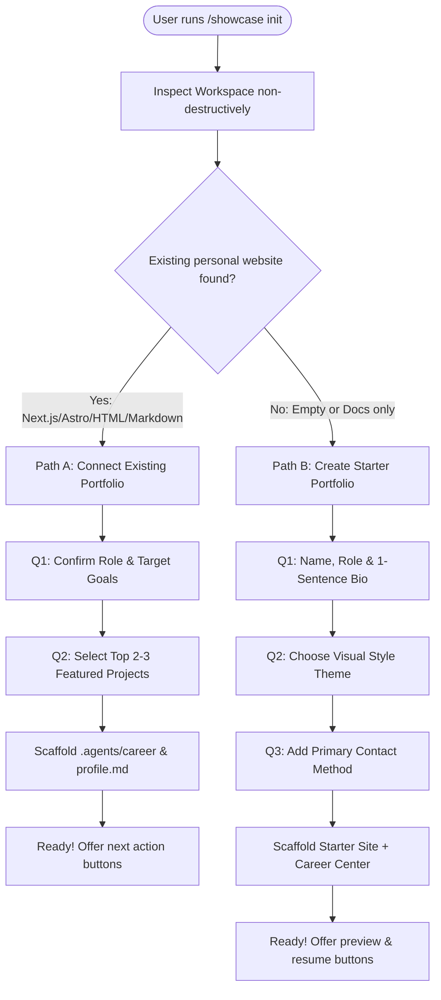
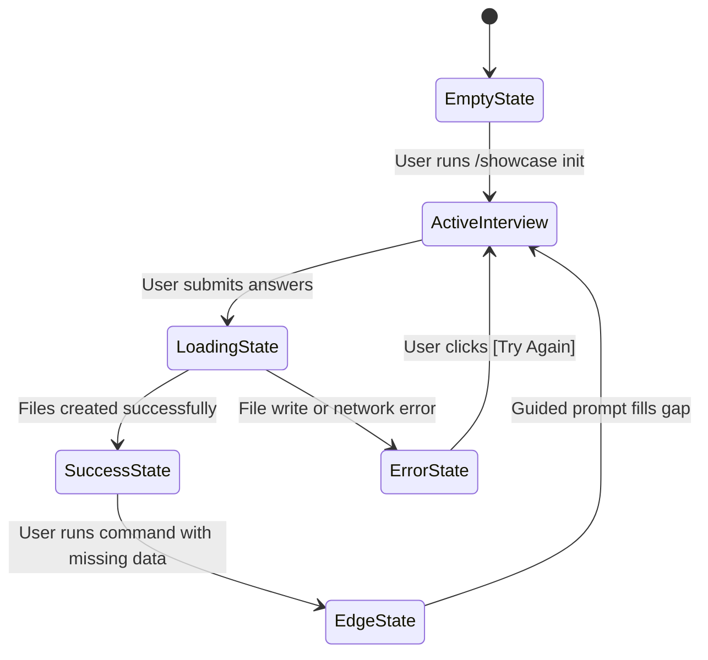
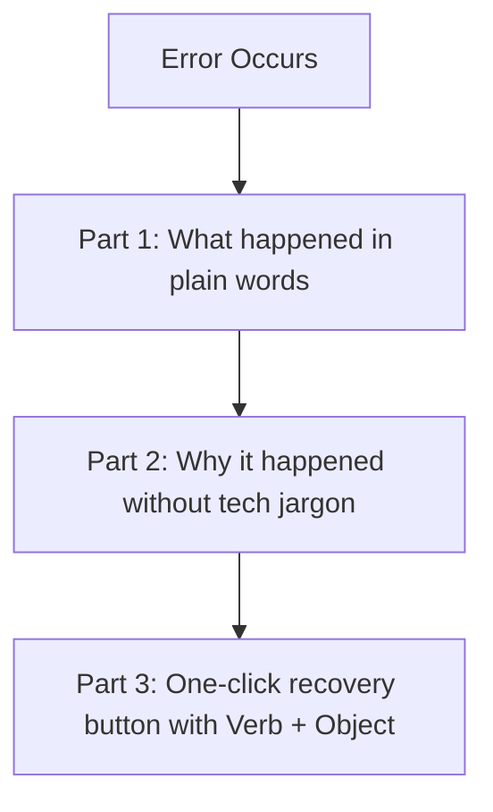
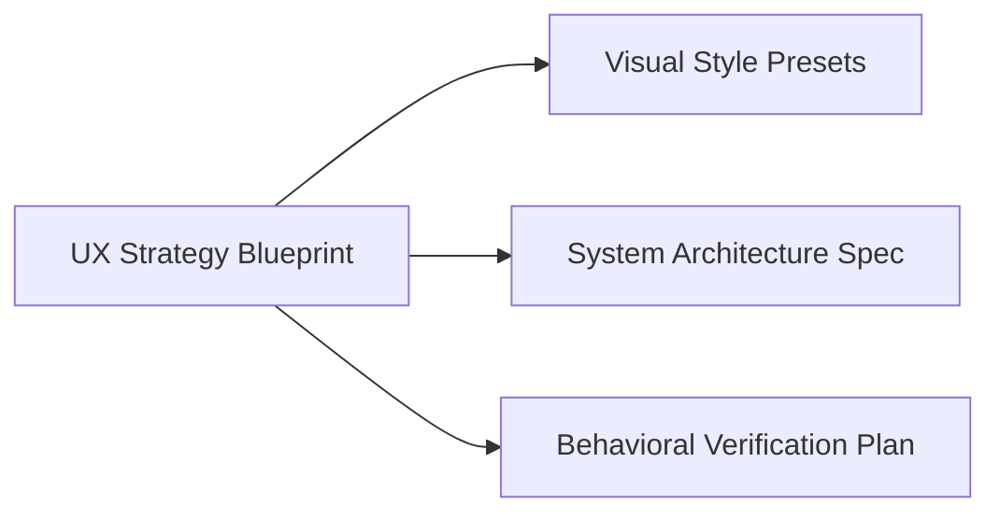

# Showcase Toolkit: UX Strategy Blueprint

**Role**: Senior Staff UX Researcher & Product Strategist  
**Target File**: `showcase/docs/specs/showcase-ux-blueprint.md`  
**Standard**: CEFR A2 User Comprehension & ASD-STE100 Simplified Technical English  

---

## 1. Executive Summary & Value Proposition

This specification defines the user experience for **Showcase**, an open, shareable personal portfolio and career toolkit. The target audience includes non-developers: product designers, copywriters, creative professionals, and career switchers, alongside software engineers.

### The Dual-Engine Value Proposition
1. **Public Showcase (Engine 1)**: A fast, clean, high-craft personal website to present work and build trust.
2. **Private Career Center (Engine 2)**: An internal AI workspace that tailors resumes, writes pitch notes, and tracks job leads.



---

### Name Evaluation & Rationale

We evaluated 8 friendly, memorable names across 3 distinct metaphor families:

| Category | Name Candidate | Pronunciation | Metaphor & Rationale | Non-Developer Fit |
| :--- | :--- | :--- | :--- | :--- |
| **Craft & Story** | **`showcase`** *(Selected)* | `/ˈʃoʊ.keɪs/` | Direct action verb. You put your best work on display. Feels proud and simple. | ⭐⭐⭐⭐⭐ Highest clarity. Zero tech jargon. |
| **Craft & Story** | **`folio`** | `/ˈfoʊ.li.oʊ/` | Classic creative shorthand for portfolio. Warm and trusted by designers. | ⭐⭐⭐⭐⭐ Natural for creatives and writers. |
| **Craft & Story** | **`craftwork`** | `/ˈkræft.wɜːrk/` | Focuses on care, quality, and personal effort. | ⭐⭐⭐⭐ Strong for makers and artisans. |
| **Stage & Spotlight** | **`spotlight`** | `/ˈspɒt.laɪt/` | Illuminates your unique achievements on stage. | ⭐⭐⭐⭐⭐ Exciting and empowering. |
| **Stage & Spotlight** | **`beacon`** | `/ˈbiː.kən/` | A guiding light that helps recruiters find you. | ⭐⭐⭐⭐ Friendly and safe feeling. |
| **Stage & Spotlight** | **`lumina`** | `/ˈluː.mɪ.nə/` | Evokes clarity, radiance, and modern elegance. | ⭐⭐⭐ Premium, editorial feel. |
| **Proof & Anchor** | **`anchor`** | `/ˈæŋ.kər/` | A steady base for all career notes and proof. | ⭐⭐⭐⭐ Solid and dependable. |
| **Proof & Anchor** | **`trailhead`** | `/ˈtreɪl.hed/` | The starting place for a great new career path. | ⭐⭐⭐⭐ Welcoming for career switchers. |

> **Conclusion**: **`showcase`** serves as the primary name and master command prefix (`/showcase`). It represents displaying personal work publicly while managing career tools privately.

---

## 2. Non-Developer Mental Models & Switching Forces

### 2.1 User Personas



1. **Maya (Product Designer)**:
   - *Context*: Needs visual case studies with before/after images.
   - *Pain*: Hates wrestling with web code. Wants a portfolio that matches her Figma craft.
2. **Alex (Content Strategist & Writer)**:
   - *Context*: Needs clean typography for articles and client work.
   - *Pain*: Keeps 12 versions of resume files in Google Drive. Dreads manual formatting.
3. **Sam (Non-Technical Career Switcher)**:
   - *Context*: Transitioning from sales into tech.
   - *Pain*: Terrified of terminal commands. Needs quick ATS-friendly job pitches.

---

### 2.2 The 4 Switching Forces



---

### 2.3 Ulwick JTBD Outcome Statements

- **Outcome 1**: Minimize time needed to create a tailored 1-page resume when applying for a job.
- **Outcome 2**: Minimize fear of breaking website files when updating project case studies.
- **Outcome 3**: Maximize confidence that public portfolio looks professional on mobile and desktop.
- **Outcome 4**: Minimize effort needed to send a personalized pitch email to a hiring manager.

---

### 2.4 Cognitive Ergonomics & BJ Fogg B=MAP Factors

To keep cognitive load within Cowan's working memory limit ($4 \pm 1$ informational chunks):
- **Chunk 1: Current Step**: Where am I right now?
- **Chunk 2: Clear Question**: What single choice must I make?
- **Chunk 3: Safe Options**: 2 to 4 simple buttons or choices.
- **Chunk 4: Instant Feedback**: What happened after I clicked?

**Fogg Simplicity Factors**:
- *Time*: Setup completes in under 2 minutes.
- *Money*: 100% free; no subscription walls.
- *Brain Cycles*: Zero code concepts. No Git branches or terminal commands mentioned.
- *Routine*: Works through normal conversational chat.

---

## 3. Command Architecture (Modular Design)

The toolkit uses a master entry point (`/showcase`) with focused subcommands.

```mermaid
flowchart TD
    CMD[/showcase] --> ROUTE{Has context?}
    ROUTE -->|No| INIT[/showcase init]
    ROUTE -->|Yes| MENU[High-Value Next Steps]
    
    INIT --> PATH_A[Path A: Existing Website]
    INIT --> PATH_B[Path B: New Starter Website]
    
    MENU --> C1[/showcase resume]
    MENU --> C2[/showcase pitch]
    MENU --> C3[/showcase publish]
    MENU --> C4[/showcase hunt]
    MENU --> C5[/showcase polish]
    MENU --> C6[/showcase profile]
```

### Command Directory

| Command | Category | User Goal | What It Does (Plain English) |
| :--- | :--- | :--- | :--- |
| `/showcase init` | Setup | Start here | Sets up your website and career files in 3 quick questions. |
| `/showcase resume [job]` | Career | Apply to a job | Creates a tailored 1-page resume for a specific job post. |
| `/showcase pitch [name]` | Career | Contact a lead | Writes a friendly, 80-word introduction email or message. |
| `/showcase publish [work]` | Portfolio | Add a project | Turns your rough notes or links into a clean case study. |
| `/showcase hunt [role]` | Career | Find opportunities | Finds open roles that match your skills and experience. |
| `/showcase polish [page]` | Design | Improve appearance | Cleans up text, spacing, and colors to look professional. |
| `/showcase profile` | Career | Update your story | Opens your master career notes so you can add new wins. |
| `/showcase preview` | Portfolio | View live work | Opens your portfolio in your web browser. |

---

## 4. Guided Onboarding Interview Flows

### Flow Decision Logic



---

### 4.1 Path A: Connect Existing Personal Portfolio (Non-Destructive)

> **Safety Rule**: Never delete, move, or overwrite existing website source files.

#### Step 1: Friendly Greeting & Inspection
```text
Hello! I looked at your folder. 
I found your existing personal website. Your website files will not be changed.

Let us set up your private career center in 2 quick steps.
```

#### Step 2: Question 1 of 2 (Role & Goals)
```text
Question 1 of 2: What is your primary title and main goal?

[Option 1] Senior Product Designer seeking full-time roles
[Option 2] Freelance Copywriter seeking client projects
[Option 3] Tech Professional seeking new opportunities
[Option 4] Type my own title...
```

#### Step 3: Question 2 of 2 (Top Achievements)
```text
Question 2 of 2: What are 2 or 3 projects or achievements you want to highlight?

(You can type short bullets or paste rough text. We will organize it for you.)
```

#### Step 4: Completion & Next Actions
```text
All set! We created your private career profile at .agents/career/profile.md.

What would you like to do next?
[Button: Tailor a Resume]  [Button: Add a Project]  [Button: View Career Notes]
```

---

### 4.2 Path B: Greenfield Starter Setup (No Website)

#### Step 1: Welcoming Start
```text
Welcome! Let us build your clean portfolio and private career center.
This takes 2 minutes. We will ask 3 simple questions.
```

#### Step 2: Question 1 of 3 (Identity)
```text
Question 1 of 3: What is your name and what do you do?

Example: "Alex Rivera — UX Researcher who turns complex data into simple products."
```

#### Step 3: Question 2 of 3 (Visual Style)
```text
Question 2 of 3: Which visual style feels right for you?

[Option 1] Warm Editorial (Warm off-white background, elegant serif headings, calm feel)
[Option 2] Clean Minimal (High contrast, modern sans-serif fonts, crisp layout)
[Option 3] Bold Creative (Vibrant accent color, expressive typography, high energy)
[Option 4] Dark Studio (Charcoal background, sleek tech feel, focused contrast)
```

#### Step 4: Question 3 of 3 (Contact Link)
```text
Question 3 of 3: How should visitors contact you?

[Option 1] Email address (e.g. alex@example.com)
[Option 2] LinkedIn profile link
[Option 3] Calendar booking link (e.g. Calendly)
```

#### Step 5: Instant Setup & Live Launch
```text
Your portfolio is ready! 

We created:
1. Your public website in your project folder.
2. Your private career center in .agents/career/.

What would you like to do first?
[Button: Preview My Website]  [Button: Tailor First Resume]  [Button: Add Project Details]
```

---

## 5. 5-State Finite State Machine (FSM) Matrix

Every interaction handles all 5 states with clear feedback and NN/g 3-part recovery copy.



### 5-State FSM Matrix

| FSM State | UI Component / View | System Action | User Viewport Content | Primary Action CTA |
| :--- | :--- | :--- | :--- | :--- |
| **1. Empty State** | Welcome Card | Reads folder status | Friendly introduction card. Explains value in 2 simple sentences. | `[Start 2-Minute Setup]` |
| **2. Active Interview** | Question Step Form | Collects input per step | Step counter (`Step 1 of 3`). Plain question text. 3-4 clickable options. | `[Continue to Next Step]` |
| **3. Loading / Processing** | Progress Checklist | Generates files and configs | Animated checklist: <br>✓ Reading your answers<br>⟳ Setting up website files...<br>○ Creating career notes | Disabled `[Building...]` |
| **4. Success State** | Completion Banner | Confirms writes | Green checkmark. 2-line summary of created items. 3 clear next actions. | `[Preview Website]` <br>`[Tailor Resume]` |
| **5. Error & Edge State** | Recovery Modal | Traps exception | **NN/g 3-Part Error**: <br>1. What happened<br>2. Why it happened<br>3. Exact fix button | `[Try Again]` <br>`[Choose Other Folder]` |

---

### NN/g 3-Part Microcopy Standards



#### Error State Scenarios & Drop-In Copy

1. **Folder Write Permission Blocked**:
   - *What happened*: We could not save your new portfolio files.
   - *Why it happened*: This folder is locked or requires administrator permission.
   - *Recovery CTA*: `[Choose Another Folder]` or `[Grant Permission and Retry]`

2. **Missing Master Profile during Resume Build**:
   - *What happened*: We cannot tailor your resume yet.
   - *Why it happened*: Your career notes file is empty. We need your background details.
   - *Recovery CTA*: `[Answer 2 Quick Questions]`

3. **Invalid Job URL in Hunt / Resume**:
   - *What happened*: We could not read this job posting link.
   - *Why it happened*: The job website requires a login or the link is private.
   - *Recovery CTA*: `[Paste Job Text Directly]`

4. **Interrupted Session / Network Drop**:
   - *What happened*: Setup paused before finishing.
   - *Why it happened*: The connection closed during file creation.
   - *Recovery CTA*: `[Resume Setup from Step 2]`

---

## 6. CEFR A2 / ASD-STE100 Copy Guide & Microcopy Samples

### 6.1 Writing Invariants
- **Active Voice**: Always write "Click the button" rather than "The button should be clicked".
- **Max 20 Words per Instruction**: Keep every task sentence under 20 words.
- **Max 25 Words per Description**: Keep every explanation under 25 words.
- **Strictly No Technical Jargon**: Use words from everyday English.

---

### 6.2 Jargon-to-Human Translation Dictionary

| Technical Jargon (Banned) | Friendly Human Translation | CEFR A2 Context Example |
| :--- | :--- | :--- |
| **Repository / Code Base** | **Project Folder** | "All your website files live inside this project folder." |
| **Scaffold / Bootstrap** | **Set Up / Create** | "We will set up your new portfolio in 2 minutes." |
| **CLI / Terminal / Shell** | **Chat Window / Assistant** | "Type your answers directly in this chat window." |
| **Deploy / Production** | **Publish Online / Launch** | "Click here to publish your website to the internet." |
| **Markdown / Frontmatter** | **Career Notes** | "We saved your work history in your career notes file." |
| **Environment Variable** | **Secret Setting** | "Add your email key in your settings card." |
| **FSM / State Machine** | **Step Progress** | "You are on step 2 of 3." |
| **AST / Code Parsing** | **Reading your text** | "Reading your project description now." |

---

### 6.3 Before-and-After Copy Transformations

#### Example 1: Starting Onboarding
- ❌ *Technical Jargon (Before)*: "Initializing workspace scaffolding and parsing repo AST to inject dual-engine architecture into root directory."
- ✅ *CEFR A2 / ASD-STE100 (After)*: "Welcome! We will now set up your website and your private career center. This takes two minutes."

#### Example 2: Resume Tailoring
- ❌ *Technical Jargon (Before)*: "Executing resume-builder agent against JD target schema using vector embeddings from master profile."
- ✅ *CEFR A2 / ASD-STE100 (After)*: "We are tailoring your resume for this job. We matched your top skills with the role requirements."

#### Example 3: Adding a Project
- ❌ *Technical Jargon (Before)*: "Scaffolding dynamic case study markdown file and updating projects.ts index array."
- ✅ *CEFR A2 / ASD-STE100 (After)*: "We added your new project to your website. You can view the live page now."

---

## 7. Verification & Implementation Handoff



### Specialist Handoff Checklist
1. **`ui-art-director`**: Build the 4 visual style presets (Warm Editorial, Clean Minimal, Bold Creative, Dark Studio) using strict WCAG AA contrast tokens. See [showcase-visual-presets.md](file:///c:/Users/ASUS/Documents/VSCode/jedmamosto-portfolio/showcase/docs/specs/showcase-visual-presets.md).
2. **`software-architect`**: Specify the dual-engine architecture and data contracts. See [showcase-system-architecture.md](file:///c:/Users/ASUS/Documents/VSCode/jedmamosto-portfolio/showcase/docs/specs/showcase-system-architecture.md) and [0001-showcase-toolkit-architecture.md](file:///c:/Users/ASUS/Documents/VSCode/jedmamosto-portfolio/showcase/docs/adr/0001-showcase-toolkit-architecture.md).
3. **`qa-behavioral-architect`**: Write test suites for Path A and Path B onboarding flows, checking all 5 FSM states and recovery dialogs. See [showcase-bvp.md](file:///c:/Users/ASUS/Documents/VSCode/jedmamosto-portfolio/showcase/docs/testing/showcase-bvp.md).
