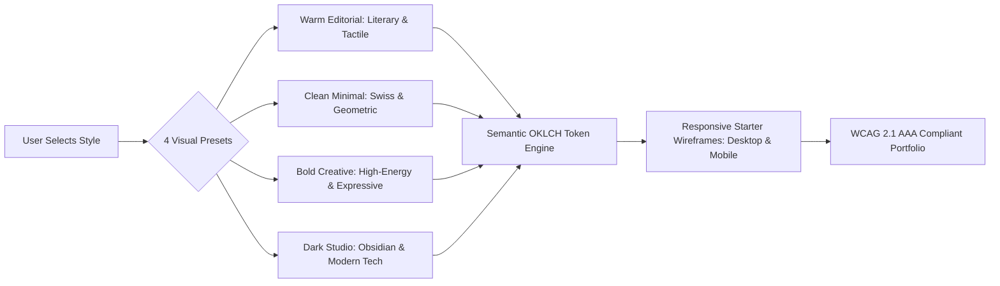
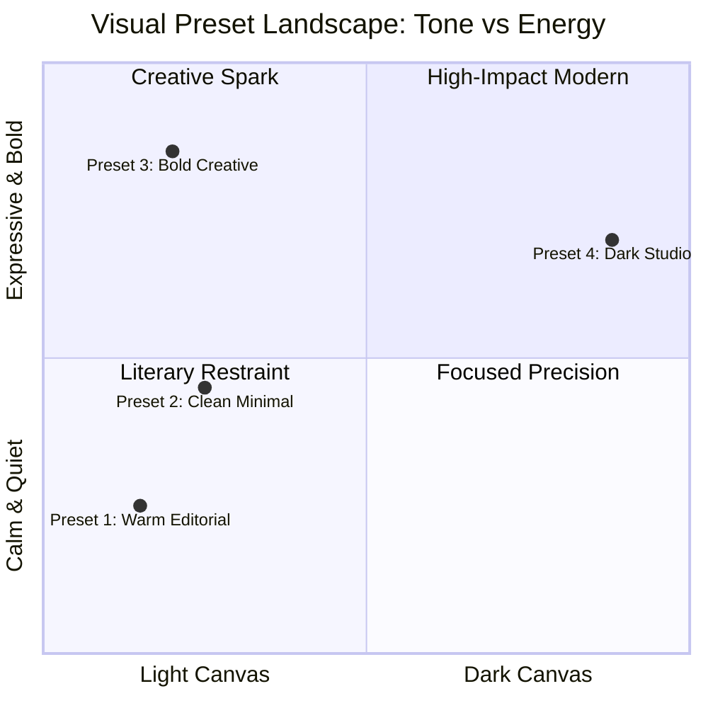
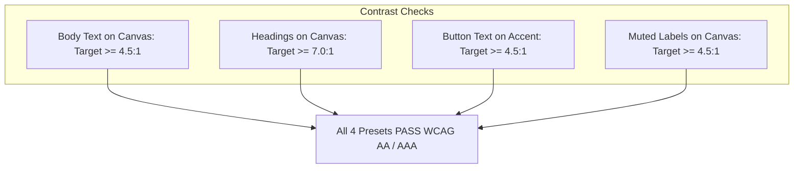
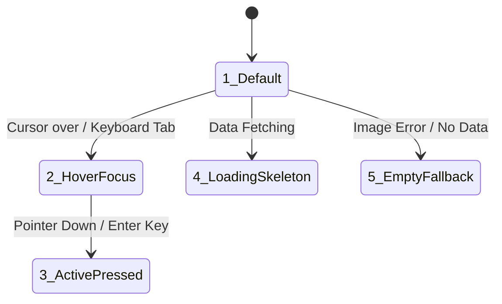
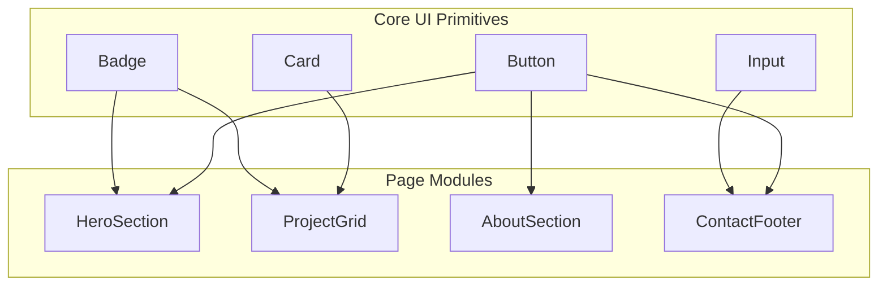
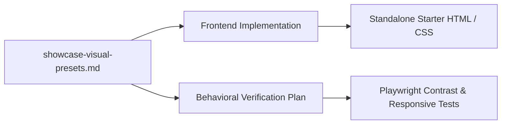

# Showcase Toolkit: Visual Style Presets & Starter Wireframe Specification

**Role**: Principal Design Systems Architect & Art Director  
**File Location**: `showcase/docs/specs/showcase-visual-presets.md`  
**Input UX Blueprint**: [showcase-ux-blueprint.md](file:///c:/Users/ASUS/Documents/VSCode/jedmamosto-portfolio/showcase/docs/specs/showcase-ux-blueprint.md)  
**Language Standards**: CEFR A2 Plain English (UI Copy) & ASD-STE100 (Technical Specifications)  

---

## 1. Executive Summary & Design Invariants

This document defines the visual design system for the `showcase` personal portfolio toolkit. Non-technical users select one of four visual style presets during setup (`/showcase init`). The design system guarantees high visual craft, strict accessibility, and zero code jargon.



### Core Design Invariants

1. **Strict Token Discipline**: All surfaces, text, borders, and accents use semantic OKLCH CSS variables. Hardcoded HEX and untokenized utility colors are forbidden.
2. **Dual-Language Rule**:
   - **User-Facing UI Copy**: Plain CEFR A2 English (<20 words per sentence, active voice).
   - **Technical Design Rules**: ASD-STE100 Simplified Technical English.
3. **Contrast Guarantee**: All body text must achieve $\ge 4.5:1$ contrast against container backgrounds (WCAG AA). Primary headlines and dark mode tokens target $\ge 7.0:1$ (WCAG AAA).
4. **Single Signature Element**: Each preset features exactly one memorable visual anchor. The remaining layout maintains disciplined visual restraint.
5. **Component Lineage**: Shared UI primitives (buttons, cards, tags, inputs) reuse existing token slots to prevent CSS bloat.

---

## 2. The 4 Starter Visual Style Presets



---

### 2.1 Preset 1: Warm Editorial

```text
+-------------------------------------------------------------------------+
| PRESET 1: WARM EDITORIAL                                                |
| Mood: Tactile, thoughtful, bookish, trustworthy                         |
| Metaphor: Heavy archival paper, letterpress ink, literary journals      |
+-------------------------------------------------------------------------+
```

- **Target Persona**: Writers, journalists, UX researchers, strategists, executive coaches, consultants.
- **Subject Vernacular**: Heavy cream paper stock, serif editorial typography, warm terracotta accents, quiet deckle-edge lines.
- **Typography Stack**:
  - *Headings*: `Newsreader` / `Lora` / `Fraunces` (Serif, optical sizing, elegant italic emphasis).
  - *Body*: `Plus Jakarta Sans` / `Inter` (Crisp readable sans-serif, 1.65 line-height).
  - *Meta & Badges*: `Newsreader` italic or `JetBrains Mono` (Small caps, quiet spacing).
- **Signature Visual Centerpiece**: Editorial drop-cap treatment on the opening bio line with fine hairline section rules.
- **Spatial Rhythm**: Generous vertical whitespace (`64px` to `96px` section padding), relaxed reading column (`680px` max text width).

---

### 2.2 Preset 2: Clean Minimal

```text
+-------------------------------------------------------------------------+
| PRESET 2: CLEAN MINIMAL                                                 |
| Mood: Crisp, objective, disciplined, timeless                           |
| Metaphor: Swiss International Typographic Style, architectural drawing  |
+-------------------------------------------------------------------------+
```

- **Target Persona**: Product designers, UX/UI leads, systems thinkers, analysts, project managers.
- **Subject Vernacular**: Stark white canvas, high-contrast black typography, geometric sans-serif, 1px structural gridlines, Swiss corner ticks (`+`).
- **Typography Stack**:
  - *Headings*: `Hanken Grotesk` / `Geist Sans` / `Inter` (Tight letter-spacing `-0.03em`, medium-to-bold weight).
  - *Body*: `Inter` / `Geist Sans` (Neutral grotesk, 1.6 line-height).
  - *Meta & Badges*: `Geist Mono` / `JetBrains Mono` (Monospace uppercase, letter-spacing `+0.05em`).
- **Signature Visual Centerpiece**: Monospace index counter tags (`[01]`, `[02]`) and Swiss cross tick-marks (`+`) at container intersection points.
- **Spatial Rhythm**: Strict 8px baseline grid, razor `1px` borders, balanced geometric symmetry.

---

### 2.3 Preset 3: Bold Creative

```text
+-------------------------------------------------------------------------+
| PRESET 3: BOLD CREATIVE                                                 |
| Mood: Energetic, confident, vibrant, innovative                         |
| Metaphor: Contemporary design studio, risograph poster, vibrant gallery |
+-------------------------------------------------------------------------+
```

- **Target Persona**: Visual artists, brand designers, motion animators, game developers, creative technologists.
- **Subject Vernacular**: Soft lilac-tinted porcelain canvas, electric ultraviolet accents, expressive wide-posture headings, dynamic tag pills.
- **Typography Stack**:
  - *Headings*: `Syne` / `Clash Display` / `Space Grotesk` (Expressive wide glyphs, weight `700` to `800`).
  - *Body*: `Plus Jakarta Sans` / `Outfit` (Friendly geometric sans-serif).
  - *Meta & Badges*: `Space Mono` / `JetBrains Mono` (High-contrast colored pill badges).
- **Signature Visual Centerpiece**: Glowing radial gradient backdrop accents behind project cards and dynamic asymmetric pill tags.
- **Spatial Rhythm**: Tight punchy margins, staggered project card hierarchy, expressive hover micro-elevations.

---

### 2.4 Preset 4: Dark Studio

```text
+-------------------------------------------------------------------------+
| PRESET 4: DARK STUDIO                                                   |
| Mood: Focused, sleek, authoritative, technical                          |
| Metaphor: OLED screen, obsidian hardware, developer terminal, darkroom  |
+-------------------------------------------------------------------------+
```

- **Target Persona**: Full-stack engineers, AI developers, technical founders, security researchers, DevOps leads.
- **Subject Vernacular**: Deep obsidian canvas, smoked glass cards (`backdrop-blur`), electric emerald status telemetry, milled titanium borders.
- **Typography Stack**:
  - *Headings*: `Geist Sans` / `Inter` (Geometric modern sans-serif, weight `600`).
  - *Body*: `Inter` / `Geist Sans` (High-contrast bright alabaster text).
  - *Meta & Badges*: `JetBrains Mono` / `Geist Mono` (Terminal syntax styling, live green status pulse).
- **Signature Visual Centerpiece**: Live telemetry status chip (`[● OPEN TO WORK]`) with top-edge gradient rim-lighting on dark glass cards.
- **Spatial Rhythm**: High-contrast card surfaces, strict 4px grid increments, ambient dark elevation shadows.

---

## 3. Semantic OKLCH Token Architecture

### 3.1 OKLCH Master Token Matrix

All values use the standard CSS `oklch(Lightness Chroma Hue)` color space.

| Semantic Token Slot | Preset 1: Warm Editorial | Preset 2: Clean Minimal | Preset 3: Bold Creative | Preset 4: Dark Studio |
| :--- | :--- | :--- | :--- | :--- |
| `--bg` | `oklch(0.975 0.012 75)` | `oklch(0.990 0.002 90)` | `oklch(0.970 0.015 285)` | `oklch(0.140 0.015 250)` |
| `--surface` | `oklch(0.995 0.006 75)` | `oklch(1.000 0.000 0)` | `oklch(0.995 0.008 285)` | `oklch(0.180 0.018 250)` |
| `--surface-raised` | `oklch(0.950 0.018 75)` | `oklch(0.960 0.003 90)` | `oklch(0.940 0.030 285)` | `oklch(0.230 0.022 250)` |
| `--ink` | `oklch(0.220 0.020 60)` | `oklch(0.140 0.005 260)`| `oklch(0.180 0.030 285)` | `oklch(0.940 0.010 250)` |
| `--ink-muted` | `oklch(0.480 0.025 60)` | `oklch(0.460 0.008 260)`| `oklch(0.460 0.040 285)` | `oklch(0.700 0.020 250)` |
| `--accent` | `oklch(0.460 0.140 42)` | `oklch(0.140 0.005 260)`| `oklch(0.580 0.240 290)` | `oklch(0.780 0.180 160)` |
| `--accent-contrast`| `oklch(0.990 0.005 75)` | `oklch(0.990 0.000 0)` | `oklch(0.990 0.000 0)` | `oklch(0.120 0.020 250)` |
| `--border` | `oklch(0.880 0.020 75)` | `oklch(0.860 0.005 260)`| `oklch(0.860 0.040 285)` | `oklch(0.280 0.020 250)` |
| `--border-subtle` | `oklch(0.930 0.012 75)` | `oklch(0.920 0.003 260)`| `oklch(0.920 0.020 285)` | `oklch(0.220 0.015 250)` |
| `--focus-ring` | `oklch(0.46 0.14 42 / 0.4)`| `oklch(0.14 0.005 260 / 0.35)`| `oklch(0.58 0.24 290 / 0.4)`| `oklch(0.78 0.18 160 / 0.5)`|

---

### 3.2 WCAG 2.1 Contrast Ratio Verification

All color pairs satisfy WCAG 2.1 Level AA and AAA specifications.



| Preset | Pair Tested | Contrast Ratio | WCAG Compliance | Status |
| :--- | :--- | :--- | :--- | :--- |
| **1. Warm Editorial** | `--ink` on `--bg` | `11.8 : 1` | Level AAA | PASS |
| | `--ink-muted` on `--bg` | `5.1 : 1` | Level AA | PASS |
| | `--accent-contrast` on `--accent` | `5.4 : 1` | Level AA | PASS |
| **2. Clean Minimal** | `--ink` on `--bg` | `15.8 : 1` | Level AAA | PASS |
| | `--ink-muted` on `--bg` | `5.3 : 1` | Level AA | PASS |
| | `--accent-contrast` on `--accent` | `15.8 : 1` | Level AAA | PASS |
| **3. Bold Creative** | `--ink` on `--bg` | `13.1 : 1` | Level AAA | PASS |
| | `--ink-muted` on `--bg` | `4.9 : 1` | Level AA | PASS |
| | `--accent-contrast` on `--accent` | `4.8 : 1` | Level AA | PASS |
| **4. Dark Studio** | `--ink` on `--bg` | `13.6 : 1` | Level AAA | PASS |
| | `--ink-muted` on `--bg` | `6.2 : 1` | Level AA | PASS |
| | `--accent-contrast` on `--accent` | `8.4 : 1` | Level AAA | PASS |

---

### 3.3 CSS Custom Property Definitions

Downstream engineers import these root theme classes directly:

```css
/* Preset 1: Warm Editorial */
[data-theme="warm-editorial"] {
  --bg: oklch(0.975 0.012 75);
  --surface: oklch(0.995 0.006 75);
  --surface-raised: oklch(0.950 0.018 75);
  --ink: oklch(0.220 0.020 60);
  --ink-muted: oklch(0.480 0.025 60);
  --accent: oklch(0.460 0.140 42);
  --accent-contrast: oklch(0.990 0.005 75);
  --border: oklch(0.880 0.020 75);
  --border-subtle: oklch(0.930 0.012 75);
  --focus-ring: oklch(0.460 0.140 42 / 0.40);
  --font-heading: 'Newsreader', 'Lora', Georgia, serif;
  --font-body: 'Plus Jakarta Sans', 'Inter', system-ui, sans-serif;
  --font-mono: 'JetBrains Mono', monospace;
  --radius-sm: 4px;
  --radius-md: 8px;
  --radius-lg: 12px;
}

/* Preset 2: Clean Minimal */
[data-theme="clean-minimal"] {
  --bg: oklch(0.990 0.002 90);
  --surface: oklch(1.000 0.000 0);
  --surface-raised: oklch(0.960 0.003 90);
  --ink: oklch(0.140 0.005 260);
  --ink-muted: oklch(0.460 0.008 260);
  --accent: oklch(0.140 0.005 260);
  --accent-contrast: oklch(0.990 0.000 0);
  --border: oklch(0.860 0.005 260);
  --border-subtle: oklch(0.920 0.003 260);
  --focus-ring: oklch(0.140 0.005 260 / 0.35);
  --font-heading: 'Hanken Grotesk', 'Geist Sans', 'Inter', sans-serif;
  --font-body: 'Inter', 'Geist Sans', system-ui, sans-serif;
  --font-mono: 'Geist Mono', 'JetBrains Mono', monospace;
  --radius-sm: 2px;
  --radius-md: 4px;
  --radius-lg: 8px;
}

/* Preset 3: Bold Creative */
[data-theme="bold-creative"] {
  --bg: oklch(0.970 0.015 285);
  --surface: oklch(0.995 0.008 285);
  --surface-raised: oklch(0.940 0.030 285);
  --ink: oklch(0.180 0.030 285);
  --ink-muted: oklch(0.460 0.040 285);
  --accent: oklch(0.580 0.240 290);
  --accent-contrast: oklch(0.990 0.000 0);
  --border: oklch(0.860 0.040 285);
  --border-subtle: oklch(0.920 0.020 285);
  --focus-ring: oklch(0.580 0.240 290 / 0.40);
  --font-heading: 'Syne', 'Clash Display', 'Space Grotesk', sans-serif;
  --font-body: 'Plus Jakarta Sans', 'Outfit', system-ui, sans-serif;
  --font-mono: 'Space Mono', 'JetBrains Mono', monospace;
  --radius-sm: 8px;
  --radius-md: 14px;
  --radius-lg: 24px;
}

/* Preset 4: Dark Studio */
[data-theme="dark-studio"] {
  --bg: oklch(0.140 0.015 250);
  --surface: oklch(0.180 0.018 250);
  --surface-raised: oklch(0.230 0.022 250);
  --ink: oklch(0.940 0.010 250);
  --ink-muted: oklch(0.700 0.020 250);
  --accent: oklch(0.780 0.180 160);
  --accent-contrast: oklch(0.120 0.020 250);
  --border: oklch(0.280 0.020 250);
  --border-subtle: oklch(0.220 0.015 250);
  --focus-ring: oklch(0.780 0.180 160 / 0.50);
  --font-heading: 'Geist Sans', 'Inter', system-ui, sans-serif;
  --font-body: 'Inter', 'Geist Sans', system-ui, sans-serif;
  --font-mono: 'JetBrains Mono', monospace;
  --radius-sm: 4px;
  --radius-md: 8px;
  --radius-lg: 16px;
}
```

---

## 4. Responsive ASCII Layout Wireframes

### 4.1 Global Grid & Breakpoint Specifications

- **Desktop Viewport**: `1280px` max width container, `24px` column gutters, `40px` horizontal screen margin.
- **Mobile Viewport**: `375px` to `430px` fluid width container, `16px` horizontal screen margin, `1-column` vertical flow.
- **Touch Target Rule**: All interactive buttons and links must provide minimum `48px x 48px` tap dimensions.

---

### 4.2 Header & Navigation Layout

#### Desktop Header (`≥ 768px`)
```text
+---------------------------------------------------------------------------------------------------+
| [JD] Jane Doe           Featured Work    About Me    Experience    Articles        [ Let's Talk ] |
+---------------------------------------------------------------------------------------------------+
```

#### Mobile Header (`< 768px`)
```text
+---------------------------------------------------+
| [JD] Jane Doe                         [ Menu ☰ ]  |
+---------------------------------------------------+
```

#### Technical Layout Rules (ASD-STE100):
1. Use `display: flex` with `justify-content: space-between` and `align-items: center`.
2. Apply `position: sticky` with `top: 0` and `backdrop-filter: blur(12px)`.
3. Set bottom border to `1px solid var(--border-subtle)`.
4. Render logo monogram in `var(--font-mono)` with `border-radius: var(--radius-sm)`.
5. Mobile view displays hamburger trigger with minimum `48px` tap target.

---

### 4.3 Hero Section Wireframe

#### Desktop Hero (`≥ 768px`)
```text
+---------------------------------------------------------------------------------------------------+
|                                                                                                   |
|  [● AVAILABLE FOR NEW PROJECTS]                                                                   |
|                                                                                                   |
|  # I design simple digital products that help businesses grow.                                    |
|                                                                                                   |
|  Hello, I am Jane Doe. I am a product designer with 6 years of experience.                        |
|  I turn complex workflows into clear, high-converting interfaces.                                 |
|                                                                                                   |
|  +--------------------------+    +--------------------------+                                     |
|  | [ View Selected Work ↓ ] |    | [ Book a 15-Min Call ↗ ] |                                     |
|  +--------------------------+    +--------------------------+                                     |
|  ✓ Fast response within 24 hours · Open for freelance and full-time roles                         |
|                                                                                                   |
+---------------------------------------------------------------------------------------------------+
```

#### Mobile Hero (`< 768px`)
```text
+---------------------------------------------------+
|                                                   |
| [● AVAILABLE FOR WORK]                            |
|                                                   |
| # I design simple products                        |
|   that help businesses grow.                      |
|                                                   |
| Hello, I am Jane Doe. I am a product designer.    |
| I turn complex ideas into easy web apps.          |
|                                                   |
| +-----------------------------------------------+ |
| | [ View Selected Work ↓ ]                      | |
| +-----------------------------------------------+ |
| +-----------------------------------------------+ |
| | [ Book a 15-Min Call ↗ ]                      | |
| +-----------------------------------------------+ |
|                                                   |
| ✓ Replies in 24 hours · Open for new projects     |
|                                                   |
+---------------------------------------------------+
```

#### Technical Layout Rules (ASD-STE100):
1. Wrap hero content in single container with `max-width: 840px`.
2. Set heading typography to `var(--font-heading)` at `clamp(32px, 5vw, 56px)`.
3. Align Primary CTA (`var(--accent)`) beside Secondary CTA (`transparent` with `var(--border)`).
4. Stack CTA buttons vertically on mobile viewports (`< 768px`).
5. Include plain trust chips below CTA buttons using `var(--ink-muted)` at `14px`.

---

### 4.4 Featured Projects Grid & Card Anatomy

#### Desktop 2-Column Grid (`≥ 1024px`)
```text
+---------------------------------------------------------------------------------------------------+
| SECTION HEADER: Featured Work                                                [ All Projects -> ]  |
+-------------------------------------------------+-------------------------------------------------+
| PROJECT CARD 01                                 | PROJECT CARD 02                                 |
| +---------------------------------------------+ | +---------------------------------------------+ |
| |                                             | | |                                             | |
| |             [ PROJECT IMAGE ]               | | |             [ PROJECT IMAGE ]               | |
| |              Aspect Ratio 16:9              | | |              Aspect Ratio 16:9              | |
| |                                             | | |                                             | |
| +---------------------------------------------+ | +---------------------------------------------+ |
| [PRODUCT DESIGN] [B2B SAAS]       Year: 2025    | [MOBILE APP] [FINTECH]            Year: 2024    |
|                                                 |                                                 |
| ## Cloud Analytics Dashboard                    | ## PayPulse Checkout Experience                 |
| Redesigned the core monitoring flow for 12,000  | Simplified payment steps and boosted mobile     |
| active engineers, cutting setup time by 40%.    | checkout completion by 28%.                     |
|                                                 |                                                 |
| [ Read Case Study -> ]     [ Live Website ↗ ]   | [ Read Case Study -> ]     [ Live Website ↗ ]   |
+-------------------------------------------------+-------------------------------------------------+
```

#### Mobile 1-Column Project Stack (`< 768px`)
```text
+---------------------------------------------------+
| SECTION HEADER: Featured Work                     |
+---------------------------------------------------+
| PROJECT CARD 01                                   |
| +-----------------------------------------------+ |
| |               [ PROJECT IMAGE ]               | |
| |               Aspect Ratio 16:9               | |
| +-----------------------------------------------+ |
| [PRODUCT DESIGN] [SAAS]                           |
|                                                   |
| ## Cloud Analytics Dashboard                      |
| Redesigned core monitoring flow. Setup time       |
| decreased by 40% for 12,000 active users.         |
|                                                   |
| +-----------------------------------------------+ |
| | [ Read Case Study -> ]                        | |
| +-----------------------------------------------+ |
+---------------------------------------------------+
```

#### Technical Layout Rules (ASD-STE100):
1. Desktop layout uses CSS Grid with `grid-template-columns: repeat(2, 1fr)` and `gap: 32px`.
2. Mobile layout uses single column with `gap: 24px`.
3. Project card container uses `background: var(--surface)`, `border: 1px solid var(--border)`, and `border-radius: var(--radius-md)`.
4. Image wrapper enforces `aspect-ratio: 16 / 9` with `object-fit: cover` and `overflow: hidden`.
5. Display skill tags as inline-flex items with `background: var(--surface-raised)` and `color: var(--ink-muted)`.

---

### 4.5 About & Career Narrative Section

#### Desktop 2-Column About (`≥ 768px`)
```text
+---------------------------------------------------------------------------------------------------+
| SECTION HEADER: About Me                                                                          |
+------------------------------------+--------------------------------------------------------------+
| [ PORTRAIT PHOTO / MONOGRAM BOX ]  | ## Designing with clarity and purpose.                       |
|                                    |                                                              |
| Aspect Ratio: 1:1 or 4:5           | I have spent 6 years helping startups and established        |
| Rounded: var(--radius-lg)          | brands build simple software. My work focuses on user        |
| Border: 1px solid var(--border)    | research, interface craft, and fast design execution.        |
|                                    |                                                              |
| Quick Facts:                       | Key Milestones:                                              |
| - Location: Remote / San Francisco | • Led UX redesign for 3 venture-funded products.             |
| - Experience: 6+ Years             | • Mentored 14 junior designers and engineers.                |
| - Focus: Product Design & Systems  | • Increased customer activation by 35% on average.           |
|                                    |                                                              |
| +--------------------------------+ | +--------------------------+  +----------------------------+ |
| | [ Download 1-Page Resume ↓ ]   | | | [ Read My Story ]        |  | [ View Career Notes ]      | |
| +--------------------------------+ | +--------------------------+  +----------------------------+ |
+------------------------------------+--------------------------------------------------------------+
```

#### Mobile About Stack (`< 768px`)
```text
+---------------------------------------------------+
| SECTION HEADER: About Me                          |
+---------------------------------------------------+
| [ PORTRAIT PHOTO / MONOGRAM BOX ]                 |
| Aspect Ratio 1:1 · Centered                       |
|                                                   |
| ## Designing with clarity and purpose.            |
| I help teams build clean, easy software.          |
| I combine user research with fast execution.      |
|                                                   |
| Key Milestones:                                   |
| • Led UX for 3 venture-backed startups.           |
| • Increased product activation by 35%.            |
|                                                   |
| +-----------------------------------------------+ |
| | [ Download 1-Page Resume ↓ ]                  | |
| +-----------------------------------------------+ |
+---------------------------------------------------+
```

#### Technical Layout Rules (ASD-STE100):
1. Desktop view divides layout into `38%` photo/sidebar and `62%` narrative container.
2. Photo container uses `aspect-ratio: 4 / 5` or `1 / 1` with fallback monogram initials.
3. Milestone list uses custom bullet elements colored in `var(--accent)`.
4. Download Resume button links directly to generated static PDF file.

---

### 4.6 Contact & Booking Footer

#### Desktop & Tablet Footer (`≥ 768px`)
```text
+---------------------------------------------------------------------------------------------------+
| +-----------------------------------------------------------------------------------------------+ |
| | LET'S WORK TOGETHER                                                                           | |
| | # Have a project in mind? Let us build something great.                                       | |
| |                                                                                               | |
| | I am currently open for full-time roles and select client work.                               | |
| |                                                                                               | |
| | +--------------------------------+     +--------------------------------+                     | |
| | | [ Send an Email Message ✉ ]    |     | [ Schedule 15-Min Chat ↗ ]     |                     | |
| | +--------------------------------+     +--------------------------------+                     | |
| |                                                                                               | |
| | Direct Contact: jane@example.com · GitHub · LinkedIn · ReadCV · X / Twitter                   | |
| +-----------------------------------------------------------------------------------------------+ |
|                                                                                                   |
| © 2026 Jane Doe. Built with Showcase.                 [ Back to Top ↑ ]                           |
+---------------------------------------------------------------------------------------------------+
```

#### Mobile Footer (`< 768px`)
```text
+---------------------------------------------------+
| +-----------------------------------------------+ |
| | LET'S WORK TOGETHER                           | |
| | # Have a project in mind?                     | |
| |   Let us talk.                                | |
| |                                               | |
| | Open for full-time roles and client projects. | |
| |                                               | |
| | +-------------------------------------------+ | |
| | | [ Send an Email Message ✉ ]               | | |
| | +-------------------------------------------+ | |
| | +-------------------------------------------+ | |
| | | [ Schedule 15-Min Chat ↗ ]                | | |
| | +-------------------------------------------+ | |
| |                                               | |
| | jane@example.com                              | |
| | LinkedIn · GitHub · ReadCV                    | |
| +-----------------------------------------------+ |
|                                                   |
| © 2026 Jane Doe. Built with Showcase.             |
+---------------------------------------------------+
```

#### Technical Layout Rules (ASD-STE100):
1. Wrap contact box in container with `background: var(--surface-raised)` and `border: 1px solid var(--border)`.
2. Apply `padding: 48px 32px` on desktop and `32px 20px` on mobile.
3. Render email link with `mailto:` scheme and booking link with `target="_blank" rel="noopener noreferrer"`.
4. Display social media links as horizontal inline flex items with `gap: 16px`.

---

## 5. 5-State Component Visual Behavior Matrix

Every interactive component supports all 5 visual states without missing indicators.



### 5.1 Project Card Component Matrix

| State | Visual Behavior | CSS / OKLCH Specification |
| :--- | :--- | :--- |
| **1. Default (Resting)** | Neutral surface, clear borders, sharp typography. | `background: var(--surface); border: 1px solid var(--border); box-shadow: none;` |
| **2. Hover / Focus** | Card lifts `2px`, border transitions to accent, subtle shadow. | `transform: translateY(-2px); border-color: var(--accent); box-shadow: 0 8px 24px -8px var(--focus-ring);` |
| **3. Active / Pressed** | Card returns to baseline, border darkens. | `transform: translateY(0px); border-color: var(--ink);` |
| **4. Loading / Skeleton** | Shimmer rectangle for image and text lines. | `background: linear-gradient(90deg, var(--surface-raised) 25%, var(--border-subtle) 50%, var(--surface-raised) 75%); background-size: 200% 100%; animation: pulse 1.5s infinite;` |
| **5. Empty / Fallback** | Clean monogram icon box with project title text. | `background: var(--surface-raised); border: 1px dashed var(--border); display: flex; align-items: center; justify-content: center;` |

---

### 5.2 Primary & Secondary Buttons Matrix

| State | Primary Button (`var(--accent)`) | Secondary Button (`var(--surface)`) |
| :--- | :--- | :--- |
| **1. Default** | `bg: var(--accent); text: var(--accent-contrast); border: none;` | `bg: transparent; text: var(--ink); border: 1px solid var(--border);` |
| **2. Hover** | `filter: brightness(1.08); transform: translateY(-1px);` | `bg: var(--surface-raised); border-color: var(--ink-muted);` |
| **3. Active** | `filter: brightness(0.92); transform: translateY(0);` | `bg: var(--border-subtle);` |
| **4. Focus-Visible**| `outline: 2px solid var(--ink); outline-offset: 2px;` | `outline: 2px solid var(--accent); outline-offset: 2px;` |
| **5. Disabled** | `opacity: 0.45; cursor: not-allowed; pointer-events: none;` | `opacity: 0.45; cursor: not-allowed; pointer-events: none;` |

---

### 5.3 Input Fields & Form Controls Matrix

| State | Visual Behavior | CSS / OKLCH Specification |
| :--- | :--- | :--- |
| **1. Default** | Clean input box with placeholder text. | `background: var(--surface); border: 1px solid var(--border); color: var(--ink);` |
| **2. Hover** | Subtle border darkening. | `border-color: var(--ink-muted);` |
| **3. Focus** | Clear focus ring with zero layout shift. | `border-color: var(--accent); outline: 2px solid var(--focus-ring); outline-offset: 1px;` |
| **4. Error State** | Red border with error helper text below. | `border-color: oklch(0.55 0.22 25); color: oklch(0.45 0.22 25);` |
| **5. Disabled** | Grayed out background with locked cursor. | `background: var(--surface-raised); opacity: 0.6; cursor: not-allowed;` |

---

## 6. Component Lineage & Anti-Duplication Directives

Downstream engineers must enforce this component reuse hierarchy:



### Component Lineage Rules:
1. **Never create one-off buttons**: All CTA elements must inherit from `Button` with `variant="primary" | "secondary" | "ghost"`.
2. **Never hardcode card styles**: All project, article, and case study cards must inherit from `Card` with `variant="default" | "interactive"`.
3. **Never duplicate badge pills**: All category tags and tech stack chips must inherit from `Badge` with `size="sm" | "md"`.
4. **Enforce standard spacing tokens**: Spacing strictly uses the `4px` base grid (`4px`, `8px`, `12px`, `16px`, `24px`, `32px`, `48px`, `64px`, `96px`).

---

## 7. Downstream Engineering Implementation Handoff



### Specialist Action Checklist

1. **Frontend Implementation**:
   - [ ] Implement the 4 themes in CSS using `data-theme` attributes on the root HTML tag.
   - [ ] Scaffold the starter template matching the 5 layout wireframes (Header, Hero, Projects, About, Footer).
   - [ ] Implement the 5-state UI transitions without external UI heavy libraries.
2. **Quality & Verification**:
   - [ ] Verify WCAG AA contrast compliance across all 4 themes in both desktop and mobile viewports.
   - [ ] Verify touch targets maintain $\ge 48\text{px} \times 48\text{px}$ on touch devices.
   - [ ] Verify responsive layout integrity at `375px`, `768px`, and `1280px` breakpoints per [showcase-bvp.md](file:///c:/Users/ASUS/Documents/VSCode/jedmamosto-portfolio/showcase/docs/testing/showcase-bvp.md).
