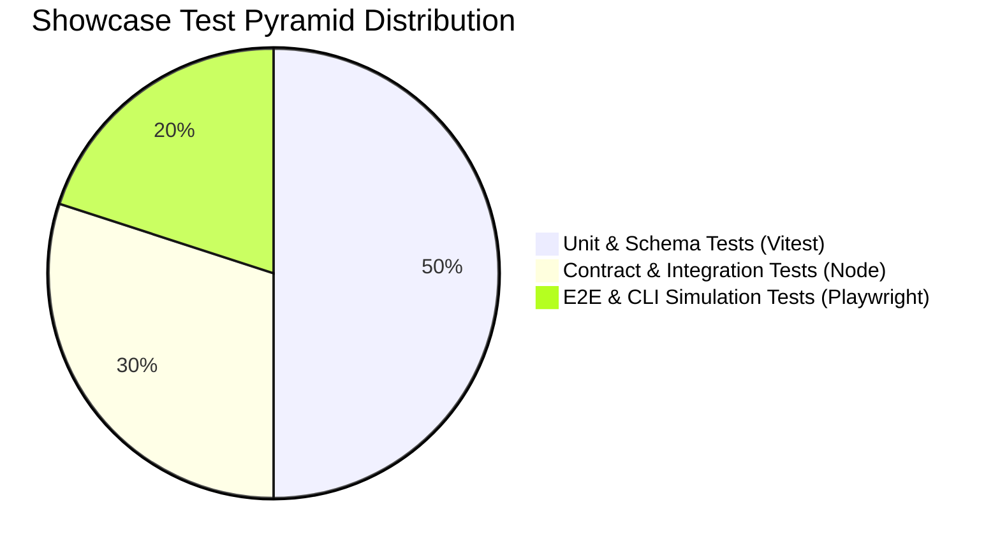
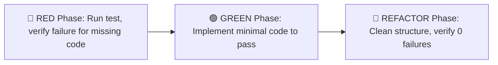

# Behavioral Verification Plan (BVP): Showcase Toolkit

**Author**: Principal Quality & Verification Architect  
**Target Path**: `showcase/docs/testing/showcase-bvp.md`  
**Input Specs**: [showcase-ux-blueprint.md](../specs/showcase-ux-blueprint.md) | [showcase-visual-presets.md](../specs/showcase-visual-presets.md) | [showcase-system-architecture.md](../specs/showcase-system-architecture.md) | [ADR-0001](../adr/0001-showcase-toolkit-architecture.md)  
**Standard**: ASD-STE100 Technical English & CEFR A2 Plain English

---

## 1. Verification Strategy & Test Pyramid Distribution

| Layer | Runner / Tool | Target Subsystem | Scope & Observable Invariants |
| :--- | :--- | :--- | :--- |
| **Unit & Schema** | Vitest (`v2.x`) | `references/*.json`, `scripts/*.js` | Schema validation, token transforms, regex detection, frontmatter parse. |
| **Integration & Contract** | Node.js Test Runner | `detect.js`, `init.js`, `compile.js` | Non-destructive backup, config serialization, file system mutations. |
| **E2E & Simulation** | Playwright / CLI fixtures | `starter-portfolio/`, CLI router | DOM rendering, WCAG AA/AAA OKLCH contrast, NN/g 3-part error flows. |

---

## 2. Acceptance Criteria Matrices (ACM)

### 2.1 Path A: Existing Personal Website Detection & Non-Destructive Safety (AC-001 to AC-005)

| ID | Scenario | Given (Initial State) | When (Action / Trigger) | Then (Observable Invariant) |
| :--- | :--- | :--- | :--- | :--- |
| **AC-001** | Framework Auto-Detection | Workspace with `package.json` containing `next`, `astro`, or `vite`. | User executes `/showcase init`. | System detects framework type, sets `mode: 'existing-portfolio'`, and specifies adapter without modifying source files. |
| **AC-002** | Zero-Deletion Safety & Backup | Existing site with custom source files and components. | Setup or sync operation runs. | Original files remain untouched; system writes timestamped `.bak.<timestamp>` file before any sync modification. |
| **AC-003** | Career Hub Injection | Existing project folder without `.agents/career/`. | Path A onboarding interview finishes. | Creates `.agents/career/profile.md` validating strictly against `profile-schema.json`. |
| **AC-004** | Directory Context Isolation | Standalone personal project folder. | User runs `/showcase init`. | System anchors `.agents/career/` to root and creates valid `showcase.config.json` without cross-project collisions. |
| **AC-005** | Config State Persistence | Path A interview completed with user contact and role choices. | System saves configuration. | Writes `showcase.config.json` containing valid schema version `1.0.0`, selected theme, and export targets. |

---

### 2.2 Path B: Greenfield Starter Setup & Visual Presets (AC-006 to AC-010)

| ID | Scenario | Given (Initial State) | When (Action / Trigger) | Then (Observable Invariant) |
| :--- | :--- | :--- | :--- | :--- |
| **AC-006** | Greenfield Scaffold | Empty directory with zero code files. | User executes `/showcase init`. | Copies `starter-portfolio/`, generates `.agents/career/profile.md`, and sets `mode: 'greenfield-starter'`. |
| **AC-007** | Preset Token Application | User selects 1 of 4 presets (`warm-editorial`, `clean-minimal`, `bold-creative`, `dark-studio`). | HTML starter builds. | Applies `data-theme` attribute on root `<html>` tag mapping semantic OKLCH CSS variables. |
| **AC-008** | Contrast & Accessibility | Rendered starter portfolio in desktop or mobile viewport. | Color contrast audit executes. | Body text maintains $\ge 4.5:1$ (AA), headlines maintain $\ge 7.0:1$ (AAA), and touch targets are $\ge 48\text{px} \times 48\text{px}$. |
| **AC-009** | 5 Layout Wireframes | Greenfield starter portfolio scaffolded. | Page opens in browser. | Header, Hero, Projects Grid, About, and Contact Footer render per wireframe specs. |
| **AC-010** | Zero-Build Preview | Starter portfolio in local file path. | User executes `/showcase preview` or opens `index.html`. | Site functions immediately in web browser without `npm install` or compilation step. |

---

### 2.3 Command Router & Action Skills (AC-011 to AC-015)

| ID | Scenario | Given (Initial State) | When (Action / Trigger) | Then (Observable Invariant) |
| :--- | :--- | :--- | :--- | :--- |
| **AC-011** | Master Router Dispatch | Valid `showcase.config.json` exists in workspace. | User runs `/showcase` without arguments. | System displays interactive menu with high-value actions (`resume`, `pitch`, `publish`, `hunt`, `polish`, `profile`). |
| **AC-012** | Resume Tailoring | Valid `profile.md` and target job text. | User runs `/showcase resume [job]`. | Compiles 1-page vector PDF, ATS plain-text buffer (`.txt`), and tailored pitch note in `applications/<slug>/`. |
| **AC-013** | Founder Pitch Note | Contact name and company role specified. | User runs `/showcase pitch [name]`. | Generates concise, proof-anchored intro message under 80 words matching `pitch_template.md`. |
| **AC-014** | Case Study Sync | Raw project notes or external repo URL. | User runs `/showcase publish [work]`. | Creates validated `.agents/career/projects/<slug>.md` and updates website data adapter automatically. |
| **AC-015** | Profile Update Loop | User wants to add new achievements. | User runs `/showcase profile`. | Opens interactive guided interview, updating `.agents/career/profile.md` while preserving YAML frontmatter schema. |

---

### 2.4 5-State FSM & NN/g Microcopy Edge Recoveries (AC-016 to AC-020)

| ID | Scenario | Given (Initial State) | When (Action / Trigger) | Then (Observable Invariant) |
| :--- | :--- | :--- | :--- | :--- |
| **AC-016** | 5-State Transitions | User initiates any toolkit flow. | System processes commands. | UI executes transitions across Empty $\rightarrow$ Active $\rightarrow$ Loading $\rightarrow$ Success $\rightarrow$ Error states without deadlocks. |
| **AC-017** | Locked Folder Recovery | Target folder lacks write permissions. | Scaffolding script attempts write. | Traps error; displays NN/g copy (What happened, Why, Recovery button: `[Choose Another Folder]`). |
| **AC-018** | Missing Profile Recovery | `.agents/career/profile.md` is missing or empty. | User runs `/showcase resume`. | Displays friendly NN/g recovery dialog with direct CTA button: `[Answer 2 Quick Questions]`. |
| **AC-019** | Job URL Fetch Failure | Target job posting is behind paywall or private. | User passes URL to `/showcase resume`. | Catches HTTP/network exception; displays NN/g recovery CTA: `[Paste Job Text Directly]`. |
| **AC-020** | Session Resume Safety | Onboarding interrupted mid-interview. | User restarts `/showcase init`. | Resumes from last uncommitted step without corrupting existing configuration or files. |

---

## 3. Fail-to-Pass (F2P) Implementation Runbook

Downstream engineers must execute this deterministic cycle:

1. **Phase 🔴 RED**: Write test fixtures matching `AC-001` through `AC-020`. Run `npm test` or `vitest run`. Confirm explicit failure against unwritten modules.
2. **Phase 🟢 GREEN**: Author minimal code in `scripts/`, `references/`, and `templates/` to satisfy assertions. Confirm all tests pass.
3. **Phase 🔵 REFACTOR**: Optimize performance and modularity. Confirm zero test regressions and clean TypeScript checks.

---

## 4. Test Fixtures & Dogfood Verification Matrix (DVM)

| Fixture ID | Directory Setup | Expected Result |
| :--- | :--- | :--- |
| **FIX-01** | Next.js personal portfolio repository | Detection: `mode=existing-portfolio`, `framework=nextjs`. Zero file deletions. |
| **FIX-02** | Astro personal portfolio repository | Detection: `mode=existing-portfolio`, `framework=astro`. Scaffolds `.agents/career/`. |
| **FIX-03** | Empty temporary folder | Detection: `mode=greenfield-starter`. Scaffolds complete starter portfolio. |
| **FIX-04** | Read-only directory | Gracefully renders NN/g 3-part permission error with `[Choose Another Folder]` CTA. |
